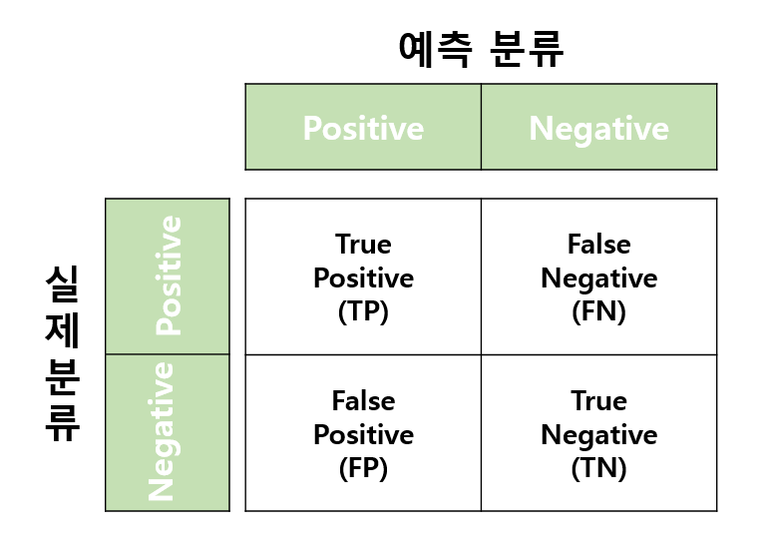
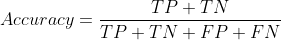
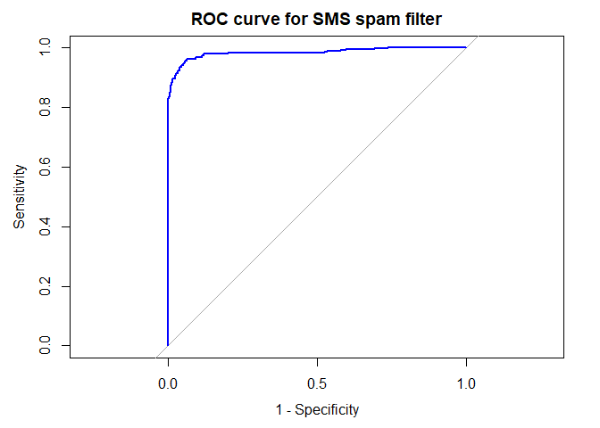
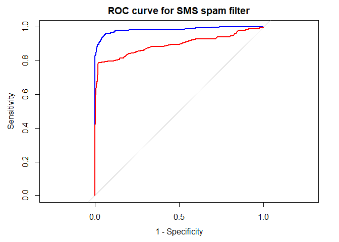

모델 성능 평가 (1)
================
*이상민*

-----

머신러닝 알고리즘은 다양한 장단점을 갖기 때문에 테스트로 학습자를 구별해야만 한다. 또한 어떤 학습자가 미래의 데이터가 잘 수행될
것인지 이해하는 것도 중요하다. 이 장에서는 기계 학습자를 평가하는 데 필요한 다음과 같은 정보를 제공한다.

  - 예측 정확도가 성능을 측정하는 데 충분치 않은 이유와 대신 사용할 수 있는 성능 척도
  - 처음 보는 케이스에 대한 모델의 예측 능력을 성능 척도에 합리적으로 반영하는 방법
  - 예측 모델에 이러한 유용한 척도와 방법을 적용하기 위한 R 사용법

## 분류 성능 측정

지금까지 분류기의 정확도는 정확한 예측 부분을 전체 예측 개수로 나누어 측정했다. 정확도는 학습자가 맞거나 틀린 경우의 비율을
나타낸다. 분류기 성능을 측정하는 여러 방법이 있지만, 가장 좋은 측정 방법은 분류기가 의도된 목적에 맞게 성공했는지를
반영하는 것이다. 있는 그대로의 정확도보다 유용성에 맞는 성능 척도를 정의하는 것이 중요하다.

-----

### 분류기의 예측 이해

분류 모델을 평가하는 목적은 미래의 케이스에 모델의 성능이 어떻게 추론할지 더 잘 이해하기 위해서이다. 대개 실행 환경에서 여전히
입증되지 않은 모델을 테스트하는 것은 실현할 수 없다. 따라서 일반적으로 미래에 처리해야 할 케이스와 유사한 케이스로 구성된
데이터셋을 모델에게 분류하도록 요청함으로써 미래의 조건을 시뮬레이션한다.

  - 실제 클래스 값
  - 예측 클래스 값
  - 추정된 예측 확률

실제 클래스 값과 예측 클래스 값은 평가의 핵심이다. 선생님이 학생의 답변을 평가할 때 정답지를 사용하듯이 기계 학습자의 예측에 대한 정답을 알아야 한다. 실제 클래스 값은 테스트 데이터셋의 목표 특징에서 직접 나온다. 예측 클래스 값은 훈련 데이터로 분류기를 구축한 후 이를 테스트 데이터에 적용해서 얻는다.   
대부분의 머신러닝 패키지는 predict() 함수를 이용하며, predicted\_outcome <- predict(model, test\_data) 와 같이 될 것이다.  
거의 모든 모델은 또 하나의 유용한 정보를 제공하는데, 분류기는 예시별로 하나의 예측을 하지만 일부 결정에는 다른 결정보다 조금 더
확신한다. 예를 들어 단어 ’무료’와 ’벨소리’가 포함된 SMS가 스팸이라는 것을 99% 확신하지만, 단어 ’오늘밤’이 포함된
SMS가 스팸이라는 것은 51%만 확신한다. 분류기는 두 경우 모두 메시지를 스팸으로 분류하지만, 하나의 결정을 다른 것보다 더
확신한다. 정확한 예측을 할 때는 완전히 자신감이 있지만 의심스러울 때는 소심해지는 학습자를 찾는 것이 이상적이다.

-----

### 혼동 행렬 (confusion matrix)

혼동 행렬은 예측 값이 실제 값과 일치하는지에 따라 예측을 범주화한 표다. 표에서 한 차원은 예측 값의 가능한 범주를 나타내고,
다른 차원은 실제 값의 가능한 범주를 나타낸다. 예측 값이 실제 값과 같을 때는 정확한 분류다.
<div>

</div>

가장 일반적인 성능 척도는 하나의 클래스를 다른 모든 클래스와 비교해 구별하는 모델의 능력을 고려한다. 관심 있는 클래스를
**긍정(positive) 클래스**라고 하며, 다른 클래스는 모두 **부정(negative) 클래스**라고 한다.

  - 참 긍정(TP, True Positive) : 관심 클래스로 정확하게 분류된
  - 참 부정(TN, True Negative) : 관심 클래스가 아닌 클래스로 정확하게 분류된
  - 거짓 긍정(FP, False Positive) : 관심 클래스로 부정확하게 분류된
  - 거짓 부정(FN, False Negative) : 관심 클래스가 아닌 클래스로 부정확하게 분류된

혼동 행렬은 가장 중요한 모델 성능 척도의 기초가 된다.

-----

### 혼동 행렬을 사용한 성능 측정

2 by 2 혼동 행렬로 예측 정확도의 정의를 다음과 같이 공식화 할 수 있다.  

<div style="text-align: center">



</div>

정확도는 참 긍정과 참 부정의 횟수를 전체 예측 횟수로 나눈 값을 나타내는 비율이다.

<div style="text-align: center">

.png)

</div>

오류율은 1-정확도로 계산할 수 있다. 직관적으로 봤을 때 95% 정확한 모델이면 5% 부정확하기 때문이다.

``` r
library(gmodels)
CrossTable(sms_results$actual_type, sms_results$predict_type)
```

    ## 
    ##  
    ##    Cell Contents
    ## |-------------------------|
    ## |                       N |
    ## | Chi-square contribution |
    ## |           N / Row Total |
    ## |           N / Col Total |
    ## |         N / Table Total |
    ## |-------------------------|
    ## 
    ##  
    ## Total Observations in Table:  1390 
    ## 
    ##  
    ##                         | sms_results$predict_type 
    ## sms_results$actual_type |       ham |      spam | Row Total | 
    ## ------------------------|-----------|-----------|-----------|
    ##                     ham |      1203 |         4 |      1207 | 
    ##                         |    16.128 |   127.580 |           | 
    ##                         |     0.997 |     0.003 |     0.868 | 
    ##                         |     0.975 |     0.026 |           | 
    ##                         |     0.865 |     0.003 |           | 
    ## ------------------------|-----------|-----------|-----------|
    ##                    spam |        31 |       152 |       183 | 
    ##                         |   106.377 |   841.470 |           | 
    ##                         |     0.169 |     0.831 |     0.132 | 
    ##                         |     0.025 |     0.974 |           | 
    ##                         |     0.022 |     0.109 |           | 
    ## ------------------------|-----------|-----------|-----------|
    ##            Column Total |      1234 |       156 |      1390 | 
    ##                         |     0.888 |     0.112 |           | 
    ## ------------------------|-----------|-----------|-----------|
    ## 
    ## 

-----

### 정확도를 넘어 : 다른 성능 척도

Max Kuhn이 개발한 분류 및 회귀 훈련 패키지(caret, Classification and Regression
Training package)에는 많은 성능 척도를 계산하는 함수가 들어있다. caret은 모델이 긍정 클래스를 분류하는 능력을
반영하는 성능 척도로 계산하기 때문에 positive 파라미터를 명시해야 한다.

``` r
library(caret)
confusionMatrix(sms_results$predict_type, sms_results$actual_type, positive = "spam")
```

    ## Confusion Matrix and Statistics
    ## 
    ##           Reference
    ## Prediction  ham spam
    ##       ham  1203   31
    ##       spam    4  152
    ##                                           
    ##                Accuracy : 0.9748          
    ##                  95% CI : (0.9652, 0.9824)
    ##     No Information Rate : 0.8683          
    ##     P-Value [Acc > NIR] : < 2.2e-16       
    ##                                           
    ##                   Kappa : 0.8825          
    ##                                           
    ##  Mcnemar's Test P-Value : 1.109e-05       
    ##                                           
    ##             Sensitivity : 0.8306          
    ##             Specificity : 0.9967          
    ##          Pos Pred Value : 0.9744          
    ##          Neg Pred Value : 0.9749          
    ##              Prevalence : 0.1317          
    ##          Detection Rate : 0.1094          
    ##    Detection Prevalence : 0.1122          
    ##       Balanced Accuracy : 0.9136          
    ##                                           
    ##        'Positive' Class : spam            
    ## 

#### 카파 통계량

카파 통계량(kappa statistic)은 우연히 정확한 예측을 할 가능성을 설명함으로써 정확도를 조정한다. 심각한 클래스
불균형이 있는 데이터셋의 경우 분류기가 가장 빈번한 클래스로만 추정하면 높은 정확도를 쉽게 얻을 수 있기 때문에 카파
통계량이 특히 중요하다.  
카파 값은 0부터 최대 1까지 범위에 있으며, 1은 모델의 예측과 실제 값이 완벽하게 일치하는 경우를 나타낸다. 일반적인 해석은
다음과 같다.

  - 거의 일치하지 않음 = 0.20보다 적음
  - 어느 정도 일치 = 0.20 \~ 0.40
  - 보통 일치 = 0.40 \~ 0.60
  - 좋은 일치 = 0.60 \~ 0.80
  - 매우 좋은 일치 = 0.80 \~ 1.00

<br>

#### 민감도와 특이도

모델의 **민감도(true positive rate)** 는 정확히 분류된 긍정 예시의 비율을 측정한다. 다음 공식처럼 민감도는 참
긍정의 개수를 전체 긍정의 개수로 나눠 계산한다. 전체 긍정은 정확히 분류된 긍정(참 긍정)뿐만 아니라 부정확하게 분류된
긍정(거짓 부정)을 모두 포함한다.

<div style="text-align: center">

.png)

</div>
 
모델의 **특이도(true negative rate)** 는 정확하게 분류된 부정 예시의 비율을 측정한다.

<div style="text-align: center">

.png)

</div>

caret 패키지는 예측 값과 실제 값 벡터에서 직접 민감도와 특이도를 계산하는 함수를 제공한다.

``` r
library(caret)
sensitivity(sms_results$predict_type, sms_results$actual_type, positive = "spam")
```

    ## [1] 0.8306011

``` r
specificity(sms_results$predict_type, sms_results$actual_type, negative = "ham")
```

    ## [1] 0.996686

민감도와 특이도는 0에서 1까지 범위에 있으며, 값이 1에 가까울수록 더 바람직하다.

<br>

#### 정밀도와 재현도

**정밀도(positive predictive value)** 는 진짜 긍정인 긍정 예시의 비율로 정의된다. 다시 말해 모델이 긍정
클래스를 예측할 때 예측이 얼마나 정확한지 여부이다. 정밀한 모델은 긍정일 가능성이 매우 높은 경우의 긍정 클래스만을 예측할
것이다. 이 모델은 매우 신뢰할 수 있다. SMS 스팸 필터의 경우 정밀도가 높으면 모델이 햄은 무시하고 오직 스팸만을
신중히 겨냥한다는 것을 의미한다.

<div style="text-align: center">

.png)

</div>

한편 **재현율** 은 결과가 얼마나 완벽한지에 대한 척도다. 민감도와 같지만 해석이 조금 다르다. 높은 재현율을 갖는 모델은 긍정
예시의 상당 부분을 차지하며, 이는 폭넓다는 것을 의미한다. SMS 스팸 필터는 다수의 스팸 메시지가 정확히 식별된다면 높은
재현율을 갖는다.

<div style="text-align: center">

.png)

</div>

caret 패키지는 예측 클래스와 실제 클래스 벡터에서 이 척도 중 하나를 계산하는 데 사용할 수 있다. 정밀도는
posPredValue() 함수를 사용하고 재현율은 앞에서 사용했던 sensitivity() 함수를 사용한다.

``` r
library(caret)
posPredValue(sms_results$predict_type, sms_results$actual_type, positive = "spam")
```

    ## [1] 0.974359

``` r
sensitivity(sms_results$predict_type, sms_results$actual_type, positive = "spam")
```

    ## [1] 0.8306011

<br>

#### F-척도

정밀도와 재현율을 하나의 값으로 결합한 성능 척도를 F-척도라고 한다(F1 score, F-score). F-척도는 조화 평균을
이용해 정밀도와 재현율을 결합한다.  
F-척도는 모델의 성능을 하나의 숫자로 설명하기 때문에 여러 모델을 나란히 비교할 수 있는 편리한 방법을 제공한다.

-----

### ROC 곡선으로 성능 트레이드오프 시각화

전형적인 ROC 다이어그램의 특성이 다음 도표에 표현되어 있다. 그림은 수직축에 참 긍정률(true positive rate)을,
수평축에 거짓 긍정률(false positive rate)을 갖는 도표상에 정의된다.


다이어그램의 왼쪽 하단 모서리에서 오른쪽 상단 모서리까지의 대각선은 예측 값이 없는 분류기를 나타낸다. 이 분류기 종류는 참
긍정과 거짓 긍정이 정확히 같은 비율로 탐지되는데, 이는 분류기가 이 둘을 구별하지 못한다는 것을 의미한다. 대각선은
다른 분류기를 판단하기 위한 기준선이다. 완벽한 분류기는 참 긍정률 100%, 거짓 긍정률 0%인 점을 통과하는 곡선이다. 이
분류기는 어떤 부정 결과를 잘못 분류하기 전에 모든 긍정을 정확하게 식별할 수 있다.  
ROC 곡선이 완벽한 분류기에 가까워질수록 분류기는 긍정 값을 더욱 잘 식별하게 된다. 이것은 **AUC(Area Under
the ROC curve)** 로 알려진 통계로 측정할 수 있다. AUC는 ROC 곡선의 아래 전체 영역을 측정하며 0.5에서 1
사이다. AUC 점수를 해석하는 규약은 학교 성적과 비슷한 체계를 사용한다.

  - A : 뛰어남 = 0.9 \~ 1.0
  - B : 매우 우수/우수 = 0.8 \~ 0.9
  - C : 보통/양호 = 0.7 \~ 0.8
  - D : 불량 = 0.6 \~ 0.7
  - E : 판별되지 않음 = 0.5 \~ 0.6

pROC를 사용해 시각화하려면 두 개의 벡터가 필요하다. 첫 번째는 긍정 클래스의 추정 확률을 갖고 있어야 하고, 두 번째는 예측
클래스 값을 갖고 있어야 한다.

``` r
library(pROC)
sms_roc <- roc(sms_results$actual_type, sms_results$prob_spam)
plot(sms_roc, main="ROC curve for SMS spam filter", col="blue", lwd=2, legacy.axes=TRUE)
```

<!-- -->

이 모델의 성능을 동일한 데이터셋에 대해 예측하는 다른 모델과 비교하고자 동일한 도면에 추가적인 ROC 곡선을 추가할 수 있다.
k-NN 모델도 훈련하여 그리면 다음과 같다.

``` r
sms_results_knn <- read.csv("sms_results_knn.csv")
sms_roc_knn <- roc(sms_results$actual_type, sms_results_knn$p_spam)
plot(sms_roc, main="ROC curve for SMS spam filter", col="blue", lwd=2, legacy.axes=TRUE)
plot(sms_roc_knn, col="red", lwd=2, add=TRUE)
```

<!-- -->

k-NN 곡선은 일관되게 더 낮은데, 이는 나이브 베이즈 기법보다 일관되게 더 좋지 않은 모델이라는 의미가 된다. 이를 정량적으로
확인하고자 AUC 계산에 pROC 패키지를 사용할 수 있다.

``` r
auc(sms_roc)
```

    ## Area under the curve: 0.9836

``` r
auc(sms_roc_knn)
```

    ## Area under the curve: 0.8942

