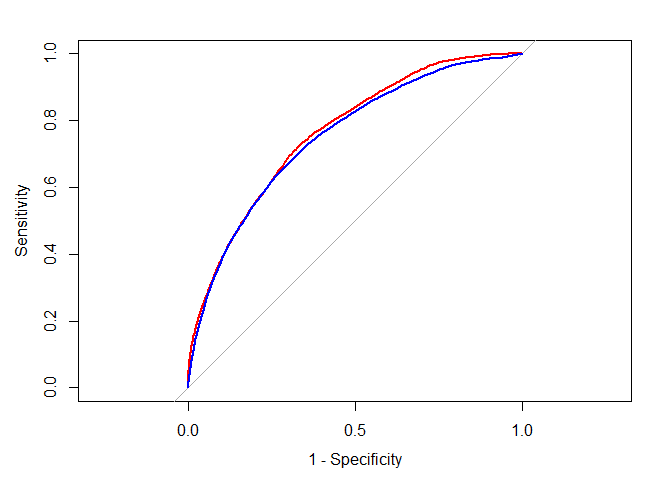

모델 성능 개선
================
*이상민*

-----

## 성능 개선을 위한 신용 모델 튜닝

신용 데이터 분류기를 구축하고자 처음에 C5.0 의사 결정 트리를 사용했다. 그때 부스팅 반복 횟수를 늘리고자 시행 횟수
파라미터를 조정해 의사 결정 트리의 성능을 개선하려고 했었다. 반복 횟수를 기본 1에서 10까지 늘려 모델의
정확도를 증가시킬 수 있었다. 최고의 적합을 찾고자 모델 옵션을 조정하는 과정을 파라미터 튜닝이라고 한다.

-----

### 자동 파라미터 튜닝을 위한 caret 사용

모델의 파라미터를 임의의 값으로 선택하는 것보다 가능한 여러 파라미터 값을 검색해서 가장 좋은 조합을 찾는 편이 낫다. 자동
파라미터 튜닝을 하려면 다음과 같은 세 가지 질문을 고려해야 한다.

  - 데이터에 대해 어떤 종류의 머신러닝 모델과 특정한 구현을 훈련해야 하는가?
  - 최적의 설정을 찾고자 어떤 모델 파라미터를 조정할 수 있고, 얼마나 광범위하게 모델 파라미터를 조정해야만 하는가?
  - 최고의 후보를 찾고자 모델을 평가하는 데 어떤 기준을 사용해야 하는가?

다음 표는 몇 가지 예측 모델의 가용한 튜닝 파라미터이다. caret은 표에 있는 옵션에 대해서만 자동 튜닝을 지원한다.

| 모델                  | 학습 작업  | 메소드 이름    | 파라미터                    |
| ------------------- | ------ | --------- | ----------------------- |
| k-최근접 이웃            | 분류     | knn       | k                       |
| 나이브 베이즈             | 분류     | nb        | fL, usekernel           |
| 의사 결정 트리            | 분류     | C5.0      | model, trials, winnow   |
| 1R 규칙 학습자           | 분류     | OneR      | 없음                      |
| RIPPER 규칙 학습자       | 분류     | JRip      | NumOpt                  |
| 선형 회귀               | 회귀     | lm        | 없음                      |
| 회귀 트리               | 회귀     | rpart     | cp                      |
| 모델 트리               | 회귀     | M5        | pruned, smoothed, rules |
| 신경망                 | 분류, 회귀 | nnet      | size, decay             |
| 서포트 벡터 머신(선형 커널)    | 분류, 회귀 | svmLinear | C                       |
| 서포트 벡터 머신(방사 기저 커널) | 분류, 회귀 | svmRadial | C, igma                 |
| 랜덤 포레스트             | 분류, 회귀 | rf        | mtry                    |

특정 모델에 대한 튜닝 파라미터를 잊었다면 modelLookup() 함수를 사용할 수 있다.

``` r
library(caret)
modelLookup("C5.0")
```

    ##   model parameter                 label forReg forClass probModel
    ## 1  C5.0    trials # Boosting Iterations  FALSE     TRUE      TRUE
    ## 2  C5.0     model            Model Type  FALSE     TRUE      TRUE
    ## 3  C5.0    winnow                Winnow  FALSE     TRUE      TRUE

자동 튜닝의 목표는 파라미터 조합의 행렬이나 그리드로 이루어진 모델 후보 집합을 검색하는 것이다. 가능한 모든 조합을 검색하는
것은 비현실적이기 때문에 그리드 구성에는 가능한 조합의 부분집합만 사용한다. 기본적으로 caret은 p개의 파라미터별로
최대 세 개의 값을 검색한다.

#### 간단한 튜닝 모델 생성

학습자를 조정하는 가장 간단한 방법은 method 파라미터를 사용해 모델 유형만 명시하는 것이다.

``` r
library(caret)
set.seed(200)
m <- train(default~., data = credit, method = "C5.0")
```

위의 명령을 입력하고 난 후 튜닝 과정이 시작되면 심각한 지연이 생길 수 있다. 데이터셋이 아주 작음에도 불구하고 상당한 양의
연산이 발생하게 된다. R은 반복적으로 데이터의 랜덤 샘플을 생성하고, 의사 결정 트리를 만들고, 성능 통계를 계산하고,
결과를 평가해야 한다.  
최고 모델을 식별한 후에 train() 함수는 튜닝 파라미터를 사용해 전체 입력 데이터셋에 대해 모델을 구축한다.

``` r
p <- predict(m, credit)
table(p, credit$default)
```

    ##      
    ## p      no yes
    ##   no  699   3
    ##   yes   1 297

<br>

#### 튜닝 절차 커스터마이징

모델 선택 과정에서 각 단계는 원하는 대로 커스터마이징할 수 있다. trainControl() 함수는 제어 객체로 알려진 설정
옵션 집합을 생성하고자 사용된다. 제어 객체는 train() 함수를 이끌어 모델의 평가 기준을 선택할 수 있게 해주며,
리샘플링 전략과 최고 모델을 선택하는 데 사용되는 척도 같은 것이 해당된다.  
trainControl() 함수의 경우 method 파라미터를 홀드아웃 샘플링이나 k-fold CV와 같은 리샘플링 방법을
설정하는 데 사용할 수 있다. 다음 표는 가능한 방법의 종류뿐 아니라 샘플 크기와 반복 횟수를 조정하는 추가
파라미터를 나열하고 있다.

| 리샘플링 방법     | 메소드 이름     | 추가 옵션 및 기본값                              |
| ----------- | ---------- | ---------------------------------------- |
| 홀드아웃 샘플링    | LGOCV      | p = 0.75 (훈련 데이터 비율)                     |
| k-폴드 CV     | cv         | number = 10 (폴드 수)                       |
| 반복 k-폴드 CV  | repeatedcv | number = 10 (폴드 수), repeats = 10 (반복 횟수) |
| 부트스트랩 샘플링   | boot       | number = 25 (리샘플링 반복)                    |
| 0.632 부트스트랩 | boot632    | number = 25 (리샘플링 반복)                    |
| LOO CV      | LOOCV      | 없음                                       |

selectionFunction 파라미터는 다양한 후보 중 최적의 모델을 선택하는 함수를 지정하는 데 사용한다.

  - best(기본) : 단순히 명시된 성능 척도에 대해 최곳값을 갖는 후보를 선택한다.
  - oneSE : 최고 성능의 1 표준 오차 내에 가장 단순한 후보를 선택한다.
  - tolerance : 사용자 지정 비율 내에 가장 단순한 후보를 사용한다.

10-폴드 CV와 oneSE 선택 함수를 사용해 ctrl이란 이름의 제어 객체를 생성하려면 다음과 같다.

``` r
ctrl <- trainControl(method = "cv", number = 10,
                     selectionFunction = "oneSE")
```

다음 단계는 최적화할 파라미터의 그리드를 생성하는 것이다. 그리드의 열은 희망하는 모델의 파라미터 이름으로 구성된다. 단, 이름
앞에 마침표가 붙는다. 또한 그리드의 행은 원하는 튜닝 파라미터 값의 조합으로 구성돼야만 한다. 이 데이터 프레임을 셀 단위로
채우기보다 제공된 값의 모든 조합으로 데이터 프레임을 만드는 expand.grid() 함수를 사용할 수 있다.

``` r
grid <- expand.grid(.model = "tree",
                    .trials = c(1, 5, 10, 15, 20, 25, 30, 35),
                    .winnow = "FALSE")
grid
```

    ##   .model .trials .winnow
    ## 1   tree       1   FALSE
    ## 2   tree       5   FALSE
    ## 3   tree      10   FALSE
    ## 4   tree      15   FALSE
    ## 5   tree      20   FALSE
    ## 6   tree      25   FALSE
    ## 7   tree      30   FALSE
    ## 8   tree      35   FALSE

train() 함수는 각 행의 모델 파라미터 조합을 이용해서 평가용 후보 모델을 구축할 것이다. 이번에는 파라미터 metric =
“Kappa”를 추가하면서 제어 객체와 튜닝 그리드를 전달할 것이다.

``` r
set.seed(200)
m <- train(default~., data=credit, method="C5.0",
           metric = "Kappa", 
           trControl = ctrl,
           tuneGrid = grid)
m
```

    ## C5.0 
    ## 
    ## 1000 samples
    ##   16 predictor
    ##    2 classes: 'no', 'yes' 
    ## 
    ## No pre-processing
    ## Resampling: Cross-Validated (10 fold) 
    ## Summary of sample sizes: 900, 900, 900, 900, 900, 900, ... 
    ## Resampling results across tuning parameters:
    ## 
    ##   trials  Accuracy  Kappa    
    ##    1      0.700     0.2523075
    ##    5      0.722     0.3126007
    ##   10      0.728     0.3114554
    ##   15      0.731     0.3295450
    ##   20      0.738     0.3382247
    ##   25      0.733     0.3327489
    ##   30      0.734     0.3317389
    ##   35      0.730     0.3151656
    ## 
    ## Tuning parameter 'model' was held constant at a value of tree
    ## Tuning
    ##  parameter 'winnow' was held constant at a value of FALSE
    ## Kappa was used to select the optimal model using  the one SE rule.
    ## The final values used for the model were trials = 15, model = tree and winnow
    ##  = FALSE.

-----

## 메타학습으로 모델 성능 개선

단일 모델의 성능을 향상시키는 방법에 대한 대안으로 몇 개의 모델을 결합해서 강력한 팀을 만들 수 있다. 일부 최고의 머신러닝
학습 알고리즘은 상호 보완적인 모델로 이루어진 팀을 활용한다. 모델은 학습 작업에 고유한 편향을 가져오기 때문에 예시의
어떤 부분은 순조롭게 학습하지만, 다른 부분에서는 어려움이 있을 수 있다. 따라서 약한 학습자 여럿으로 이루어진 강한
학습자를 만들 수 있다.

-----

### 앙상블의 이해

다양한 전문가 팀을 만드는 것과 유사한 원리를 활용하는 메타학습 방법을 **앙상블(ensemble)**이라고 한다. 다음 두 가지
질문의 답변으로 다양한 앙상블 방법을 대부분 구분할 수 있다.

  - 약한 학습 모델이 어떻게 선택되고 구성되는가?
  - 하나의 최종 예측을 만들고자 약한 학습자의 예측이 어떻게 결합되는가?


앙상블을 사용하는 이점 중 하나는 단일의 최고 모델을 추구하는 데 소요되는 시간을 단축할 수 있다는 점이다. 대신 적당히 강한
여러 후보를 훈련하고 결합할 수 있다. 또한 앙상블은 단일 모델에 비해 많은 성능적 혜택도 제공한다.

  - 미래 문제에 대한 더 나은 일반화 가능성 : 여러 학습자의 의견이 최종 예측으로 통합되므로 하나의 편향이 우세할 수 없다.
    따라서 과적합될 가능성이 줄어든다.
  - 대용량이나 극소량의 데이터셋에 대한 향상된 성능 : 극도로 많은 특징이나 예시가 사용될 때 모델이 대부분 메모리나 복잡도의
    한계에 도달하므로, 하나의 완전한 모델보다 여러 소형 모델을 훈련하는 것이 더 효율적이다.
  - 여러 도메인 데이터를 합성하는 능력 : 모든 분야에 적용되는 학습 알고리즘은 없기 때문에 여러 유형의 학습자에서 얻은
    증거를 통합하는 앙상블의 능력이 점점 더 중요해지고 있다.
  - 어려운 학습 작업에 대한 조금 더 섬세한 이해 : 작업을 작은 부분으로 분할하는 모델은 하나의 전역적인 모델이 놓치는
    미세한 패턴을 보다 정확히 포착할 수 있다.

#### 배깅 (bagging)

처음으로 광범위하게 수용된 앙상블 방법 중 하나는 부트스트랩 집계(bootstrap aggregating) 또는 짧게
**배깅**이라고 불리는 기법을 사용했다. 배깅은 원래 훈련 데이터를 부트스트랩 샘플링해 여러 훈련 데이터셋을
생성한다. 그다음 이 데이터셋은 단일 학습 알고리즘을 사용하는 여러 모델을 생성하는 데 사용된다. 모델의 예측은
투표 또는 평균화를 이용해서 결합된다.  
배깅은 비교적 간단한 앙상블이지만 상대적으로 불안정한 학습자, 즉 입력 데이터가 아주 조금 변경될 때 많이 변화하는 경향을 가진
모델을 생성하는 학습자처럼 사용되는 동안은 매우 잘 수행된다. 이러한 이유로 배깅은 입력 데이터에 사소한 변화가 있을 때 매우
극적으로 변화하는 경향을 가진 의사 결정 트리와 함께 자주 사용된다. ipred 패키지를 설치한 후에 다음과 같이 앙상블을 생성할
수 있다. nbagg 파라미터는 앙상블에서 투표할 수 있는 의사 결정 트리 수를 제어하는 데 사용한다.

``` r
library(ipred)
set.seed(200)
mybag <- bagging(default~., data=credit, nbagg=25)

credit_pred <- predict(mybag, credit)
table(credit_pred, credit$default)
```

    ##            
    ## credit_pred  no yes
    ##         no  699   1
    ##         yes   1 299

이것이 미래 성능으로 어떻게 변환되는지 보려면 caret 패키지의 train() 함수를 이용해서 10-폴드 교차 검증처럼 배깅
트리를 사용할 수 있다.

``` r
library(caret)
set.seed(200)
ctrl <- trainControl(method="cv", number=10)
train(default~., data=credit, method="treebag",
      trControl=ctrl)
```

    ## Bagged CART 
    ## 
    ## 1000 samples
    ##   16 predictor
    ##    2 classes: 'no', 'yes' 
    ## 
    ## No pre-processing
    ## Resampling: Cross-Validated (10 fold) 
    ## Summary of sample sizes: 900, 900, 900, 900, 900, 900, ... 
    ## Resampling results:
    ## 
    ##   Accuracy  Kappa    
    ##   0.74      0.3484583

-----

### 부스팅 (boosting)

또 다른 일반적인 앙상블 기반의 방법은 ***부스팅***이라고 하는데, 약한 학습자의 성능을 올려서 강한 학습자의 성능을 얻기
때문이다.  
배깅과 유사하게 부스팅은 리샘플링된 데이터에 대해 훈련된 모델의 앙상블과 최종 예측을 결정하고자 투표를 사용한다. 두 가지 주요
차이점이 있다. 첫 번째로 부스팅에서 리샘플링된 데이터셋은 상호 보완적인 학습자를 생성하도록 특별히 구성되어야 한다. 두
번째로 부스팅은 각 학습자에게 동일한 표를 주는 대신 표에 과거 성능을 기반으로 하는 가중치를 부여한다. 따라서 성능이
좋은 모델은 앙상블의 최종 예측에 더 큰 영향을 미친다.  
**에이다부스트(AdaBoost)** 또는 적응형 부스팅(adaptive boosting)으로 불리는 부스팅 알고리즘은 자주
오분류되는 예시에 가중치를 더 주어 분류하기 힘든 예시의 대부분을 반복적으로 학습하는 약한 학습자를 만든다는 아이디어를
기반으로 한다.  
부스팅의 원리는 어떤 종류의 모델에도 거의 적용될 수 있지만, 가장 일반적으로 의사 결정 트리처럼 사용된다. AdaBoost.M1
알고리즘은 분류용 에이다부스트 트리 기반의 다른 구현을 제공한다.

``` r
library(adabag)
set.seed(200)
m_adaboost <- boosting(default~., data=credit)

p_adaboost <- predict(m_adaboost, credit)
head(p_adaboost$class)
```

    ## [1] "no"  "yes" "no"  "no"  "yes" "no"

``` r
p_adaboost$confusion
```

    ##                Observed Class
    ## Predicted Class  no yes
    ##             no  700   0
    ##             yes   0 300

에이다부스트 모델은 실수가 전혀 없는 것처럼 보이는데, 이 혼동 행렬은 훈련 데이터에 대한 모델 성능을 기반으로 하기 때문이다.
부스팅은 오류율이 임의의 수준으로 낮아지는 것을 허용하기 때문에 학습자는 단순히 더 이상 오류가 없을 때까지 계속 진행됐다.
이렇게 되면 훈련 데이터셋에 대해 과적합될 가능성이 있다.  
처음 보는 데이터로 조금 더 정확한 성능 평가를 하려면 다른 평가 방법을 사용할 필요가 있다. adabag 패키지는 10-폴드
교차 검증을 사용하는 간단한 함수를 제공한다.

``` r
library(adabag)
set.seed(200)
adaboost_cv <- boosting.cv(default~., data=credit)
```

    ## i:  1 Wed May 13 13:21:42 2020 
    ## i:  2 Wed May 13 13:23:08 2020 
    ## i:  3 Wed May 13 13:24:32 2020 
    ## i:  4 Wed May 13 13:25:46 2020 
    ## i:  5 Wed May 13 13:27:04 2020 
    ## i:  6 Wed May 13 13:28:28 2020 
    ## i:  7 Wed May 13 13:29:51 2020 
    ## i:  8 Wed May 13 13:31:18 2020 
    ## i:  9 Wed May 13 13:32:41 2020 
    ## i:  10 Wed May 13 13:34:10 2020

``` r
adaboost_cv$confusion
```

    ##                Observed Class
    ## Predicted Class  no yes
    ##             no  588 161
    ##             yes 112 139

vcd 패키지를 사용해 카파 통계량을 발견할 수 있다.

``` r
library(vcd)
Kappa(adaboost_cv$confusion)
```

    ##             value     ASE     z  Pr(>|z|)
    ## Unweighted 0.3182 0.03266 9.742 2.004e-22
    ## Weighted   0.3182 0.03266 9.742 2.004e-22

-----

### 랜덤 포레스트 (random forest)

**랜덤 포레스트**라고 하는 다른 앙상블 기반의 방법은 의사 결정 트리의 앙상블에만 집중한다. 이 방법은 의사 결정 트리 모델에
다양성을 추가하고자 배깅의 기본 원리와 임의의 특징 선택을 결합한다. 트리 앙상블이 생성된 후 모델은 트리의 예측을 결합하고자
투표를 사용한다.  
다른 앙상블 기반의 방법과 비교해서 랜덤 포레스트는 매우 경쟁력 있고 핵심 이점을 제공한다. 예를 들어 랜덤 포레스트는 사용이
쉽고 과적합되지 않는다.

| 장점                               | 단점                          |
| -------------------------------- | --------------------------- |
| 모든 문제에 대해 잘 수행되는 다목적 모델          | 모델 해석이 쉽지 않음                |
| 가장 중요한 특징만을 선택                   | 모델을 데이터에 맞춰 튜닝하려면 약간의 작업 필요 |
| 극도로 큰 개수의 특징이나 예시가 있는 데이터에 사용 가능 |                             |

#### 랜덤 포레스트 훈련

기본적으로 randomForest() 함수는 각 분할 시점에 sqrt(p)개의 랜덤 특징을 고려하는 500개 트리의 앙상블을
생성한다. 이때 p는 훈련 데이터셋의 특징 개수이다. 일반적으로 학습 문제가 복잡해지고 데이터셋이 커질수록 대량의
트리에 더 잘 작동하지만, 많은 트리를 훈련하는 계산 비용과 균형을 맞춰야 할 필요가 있다.  
대량의 트리를 이용하는 목표는 각각의 특징이 여러 모델에 나타날 기회를 갖게 충분히 훈련하는 것이다. 이 목표가 mtry
파라미터의 기본값이 sqrt(p)인 근거가 된다. 예를 들어 신용 데이터는 16개의 특징을 갖기 때문에 각
트리는 어느 시점이든 네 개의 특징으로 분할되도록 제약을 받는다.

``` r
library(randomForest)
set.seed(200)
rf <- randomForest(default~., data=credit)

rf
```

    ## 
    ## Call:
    ##  randomForest(formula = default ~ ., data = credit) 
    ##                Type of random forest: classification
    ##                      Number of trees: 500
    ## No. of variables tried at each split: 4
    ## 
    ##         OOB estimate of  error rate: 23%
    ## Confusion matrix:
    ##      no yes class.error
    ## no  644  56        0.08
    ## yes 174 126        0.58

언뜻 보기에 혼동 행렬에 따르면 외관상 나쁜 성능을 보여주는 것 같지만, 이 혼동 행렬은 재치환 오류를 보여주지 않는다. 대신
**OOB(Out-Of-Bag) 오류율**을 나타내는데, 이 값은 재치환 오류와는 달리 편향되지 않은 테스트 집합의 오류
추정치다. 이는 미래 성능의 매우 합리적인 추정치라는 것을 의미한다.  
OOB 예측에서 카파 통계량을 계산하려면 다음과 같이 vcd 패키지에 있는 함수를 사용한다.

``` r
library(vcd)
Kappa(rf$confusion[1:2, 1:2])
```

    ##            value     ASE     z  Pr(>|z|)
    ## Unweighted 0.383 0.03207 11.94 7.001e-33
    ## Weighted   0.383 0.03207 11.94 7.001e-33

<br>

#### 시뮬레이션된 경쟁에서의 랜덤 포레스트 성능 평가

자동 튜닝 랜덤 포레스트와 앞에서 개발했던 자동 튜닝 부스팅 C5.0 최고 모델과 비교해본다. 먼저 caret을 로드하고 훈련
제어 옵션을 설정해야 한다. 가장 정확하게 모델 성능을 비교하고자 반복 10-폴드 CV를 이용할 것이다. 이 방법은 모델을
구축하는 데 시간이 많이 걸리고 평가를 하고자 계산하는 강도가 더 높지만, 최종 비교이므로 옳은 선택이라고 확신해야 한다.

``` r
library(caret)
ctrl <- trainControl(method = "repeatedcv",
                     number = 10, repeats = 10,
                     selectionFunction = "best",
                     savePredictions = TRUE,
                     classProbs = TRUE,
                     summaryFunction = twoClassSummary)
grid_rf <- expand.grid(.mtry = c(2, 4, 6, 8))

set.seed(200)
m_rf <- train(default~., data=credit, method="rf",
              metric="ROC", trControl=ctrl,
              tuneGrid=grid_rf)

grid_c50 <- expand.grid(.model = "tree",
                        .trials = c(10, 25, 50, 100),
                        .winnow = FALSE)
set.seed(200)
m_c50 <- train(default~., data=credit, method="C5.0",
               metric="ROC", trControl=ctrl,
               tuneGrid=grid_c50)

m_rf
```

    ## Random Forest 
    ## 
    ## 1000 samples
    ##   16 predictor
    ##    2 classes: 'no', 'yes' 
    ## 
    ## No pre-processing
    ## Resampling: Cross-Validated (10 fold, repeated 10 times) 
    ## Summary of sample sizes: 900, 900, 900, 900, 900, 900, ... 
    ## Resampling results across tuning parameters:
    ## 
    ##   mtry  ROC        Sens       Spec     
    ##   2     0.7613524  0.9910000  0.0950000
    ##   4     0.7724619  0.9424286  0.3026667
    ##   6     0.7764476  0.9182857  0.3653333
    ##   8     0.7785667  0.9080000  0.3916667
    ## 
    ## ROC was used to select the optimal model using the largest value.
    ## The final value used for the model was mtry = 8.

``` r
m_c50
```

    ## C5.0 
    ## 
    ## 1000 samples
    ##   16 predictor
    ##    2 classes: 'no', 'yes' 
    ## 
    ## No pre-processing
    ## Resampling: Cross-Validated (10 fold, repeated 10 times) 
    ## Summary of sample sizes: 900, 900, 900, 900, 900, 900, ... 
    ## Resampling results across tuning parameters:
    ## 
    ##   trials  ROC        Sens       Spec     
    ##    10     0.7393929  0.8608571  0.4400000
    ##    25     0.7516095  0.8580000  0.4523333
    ##    50     0.7560952  0.8672857  0.4506667
    ##   100     0.7597286  0.8720000  0.4506667
    ## 
    ## Tuning parameter 'model' was held constant at a value of tree
    ## Tuning
    ##  parameter 'winnow' was held constant at a value of FALSE
    ## ROC was used to select the optimal model using the largest value.
    ## The final values used for the model were trials = 100, model = tree and
    ##  winnow = FALSE.

이러한 맞비교 결과를 바탕으로 mtry = 16인 랜덤 포레스트 모델이 승자로 보인다. 성능을 시각화하고자 ROC 곡선 도식화를
위한 pROC 패키지를 사용한다.

``` r
library(pROC)
roc_rf <- roc(m_rf$pred$obs, m_rf$pred$yes)
roc_c50 <- roc(m_c50$pred$obs, m_c50$pred$yes)
plot(roc_rf, col = "red", legacy.axes = TRUE)
plot(roc_c50, col = "blue", add = TRUE)
```

<!-- -->

예상대로 결과 곡선은 랜덤 포레스트가 부스트 C5.0 모델을 앞서고 있음을 보여준다. 랜덤 포레스트는 위의 R 도면의 가장 바깥
곡선이다.
