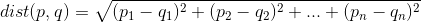

최근접 이웃 분류의 이해
================
*이상민*

-----

## 최근접 이웃 분류 (nearest neighbor classification)

최근접 이웃 분류기를 한 문장으로 설명하자면 레이블이 없는 예시를 레이블된 유사한 예시의 클래스로 할당해 분류하는 특징으로 정의할
수 있다. 최근접 이웃 분류에서는 컴퓨터가 현재 상황에 대한 결론을 얻고자 과거의 경험을 되살리는, 마치 사람과 같은 회상 능력을
적용한다. 이는 다음과 같은 **k-NN** 알고리즘 응용 분야에서 사용된다.

  - 정지 영상과 동영상에서 광학 글자 인식과 얼굴 인식을 포함하는 컴퓨터 비전 응용
  - 어떤 개인이 영화나 음악을 좋아할 것인지 예측하는 추천 시스템
  - 특정 단백질과 질병 발견에 사용 가능한 유전자 데이터의 패턴 인식

-----

### k-NN 알고리즘

분류를 위한 최근접 이웃 방법 중 가장 대표적인 **k-최근접 이웃**(k-NN, k-nearest neighbor) 알고리즘이
있다.

| 장점                     | 단점                                   |
| ---------------------- | ------------------------------------ |
| 단순하고 효율적               | 적절한 k 선택 필요                          |
| 빠른 훈련 단계               | 느린 분류 단계                             |
| 기저 데이터 분포에 대한 가정 하지 않음 | 모델을 생성하지 않아 특징과 클래스 간 관계를 이해하는 능력 제약 |

글자 k는 최근접 이웃의 개수를 임의로 사용해도 된다는 것을 의미하는 변수 항목이다. k가 선택되면 알고리즘은 여러 범주로 분류돼
명목 변수로 레이블된 예시로 구성된 훈련 데이터셋을 필요로 한다.  
그 후 테스트 데이터셋의 레이블이 없는 각 레코드에 대해 훈련 데이터에서 유사도 기준으로 가장 가까운 k개의 레코드를 찾는다.
레이블이 없는 테스트 인스턴스는 k개 최근접 이웃의 대다수를 나타내는 클래스에 배정한다.   

#### **거리로 유사도 측정**

레이블이 없는 인스턴스에 대한 최근접 이웃을 찾으려면 거리 함수나 두 인스턴스 간의 유사를 측정해야한다. 전통적으로 k-NN
알고리즘은 **유클리드 거리**를 사용한다. 유클리드 거리는 다음 공식으로 정의된다.

p와 q는 비교될 예시고, n개의 특징을 갖는다.   

#### **적절한 k 선택**

k-NN에 사용할 이웃의 개수는 모델이 미래 데이터에 대해 일반화되는 능력을 결정한다. k를 큰 값으로 선택하면 노이즈가 많은
데이터로 인한 영향이나 분산은 감소하지만, 작더라도 중요한 패턴을 무시하는 위험을 감수하는 학습자로 편향될 수 있다.  
실제 k의 선택은 학습될 개념의 난이도와 훈련 데이터의 레코드 개수에 의존한다. 보통 관례적으로 k를 훈련 예시 개수의 제곱근으로
두고 시작한다. 예를 들어 훈련 데이터에 15개의 레이블이 있다면, 15의 제곱근은 3.87이므로 k=4로 설정한다. 하지만
이러한 규칙으로는 최적의 k를 항상 정의할 수는 없다.   

#### **k-NN 사용을 위한 데이터 준비**

일반적으로 특징은 k-NN 알고리즘에 적용하기 전에 표준 범위로 변환된다. 이 과정이 필요한 이유는 거리 공식이 특정한 측정
방법에 매우 의존적이기 때문이다. 따라서 특징 값의 범위가 서로 다를 경우 특징을 재조정해 각 특징이 거리 공식에
상대적으로 동일하게 해주는 것이다. 이렇게 크기 조정을 하기 위한 몇 가지 방법이 있다.  
전통적인 방법은 **최소-최대 정규화**이다. 이 과정은 모든 값이 0에서 1 사이 범위에 있도록 특징을 변환한다.

.png)

이 공식은 각 특징 X 값에서 최솟값을 빼고 X의 범위로 나눈다.    
다른 일반적인 변환은 **z-점수 표준화**이다. 다음 공식은 특징 X에서 평균값을 빼고 그 결과를 X의 표준 편차로 나눈다.

.png)

결과 값은 z-점수라고 한다. 정규화 값과 달리 z-점수는 미리 정의된 최솟값과 최댓값이 없다.    
유클리드 거리 공식은 명목 데이터에는 정의되지 않는다. 따라서 이러한 경우에는 계산하고자 하는 특징을 수치 형식으로 변환할 필요가
있다. 대표적인 해결책은 더미 코딩이다. 더미 코딩에서 값 1은 해당 범주를 나타내고, 0은 다른 범주를 나타낸다. 예를 들어
성별 변수의 더미 코딩은 다음과 같다.

.png)

n-범주 명목 특징은 특징의 (n-1) 레벨의 이진 지수 변수를 생성해서 더미 코드화할 수 있다. 더미 코딩의 편리한 면은 특징
사이의 거리가 항상 1이거나 0이라는 점이다. 따라서 최소-최대 정규화가 적용된 수치 데이터와 동일한 범위에 속한다.

-----

### k-NN 알고리즘이 게으른 이유

최근접 이웃 방법에 기반을 둔 분류 알고리즘은 게으른 학습 (lazy learning)이라고 하는데, 이는 추상화가 일어나지 않기
때문이다. 훈련 데이터를 글자 그대로 저장하기만 하기 때문에 훈련 단계가 매우 빠르게 일어난다. 하지만 실제 훈련 단계에서는
아무것도 훈련하지 않는다.  
단점은 예측 단계가 훈련 단계에 비해 상대적으로 느린 경향이 있다는 점이다. 추상화된 모델보다 훈련 인스턴스에 많이 의존하기
때문에 게으른 학습은 인스턴스 기반 학습 또는 암기 학습이라고도 한다.

