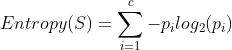
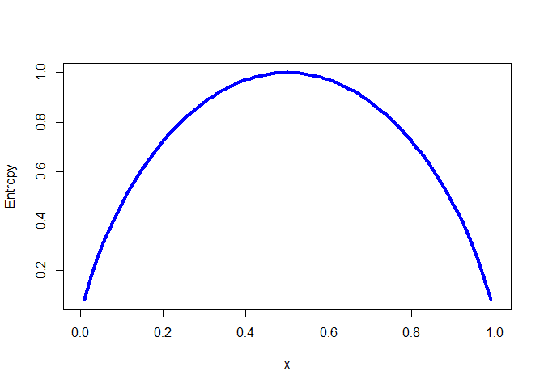

의사 결정 트리의 이해
================
*이상민*

-----

## 의사 결정 트리 (decision tree)

의사 결정 트리 학습자는 강력한 분류기로 특징과 잠재적 결과 간의 관계를 모델링하고자 트리 구조를 활용한다. 예측 모델의 경우
트리에서 일련의 사건이 발생하면 리프 노드에서는 예상되는 결과를 제공한다. 의사 결정 트리 알고리즘의 큰 장점은 순서도
같은 트리 구조가 학습자의 내부적인 용도로만 사용되는 것은 아니라는 점이다. 대다수의 의사 결정 트리 알고리즘은 그 구조를
사람이 읽을 수 있는 형식으로 출력한다. 따라서 엄청난 통찰력을 제공해준다.  
트리는 적용 가능성이 넓기는 하지만 이상적으로 맞지 않는 시나리오를 눈여겨볼 필요가 있다. 그런 경우 중 하나가 데이터에 다수의
명목 특징이 여러 레벨로 이루어져 있거나 다수의 수치 특징이 있는 경우이다. 이 경우 트리가 복잡해지고 과적합되는 경향을 갖게
된다.

-----

### 분할 정복

의사 결정 트리는 **재귀 분할**(recursive partitioning)이라고 불리는 휴리스틱을 사용해 만든다. 이 방법은
일반적으로 분할 정복으로 알려져 있는데, 데이터를 부분집합으로 나누고 그다음 더 작은 부분집합으로 반복해서 나누며, 알고리즘이
부분 집합의 데이터가 충분히 동질적이라고 판단하거나 다른 종료 조건을 만나 과정이 종료될 때까지 계속되기 때문이다.  
처음 루트 노드에서 의사 결정 트리 알고리즘은 분할하고자 하는 특징을 선택해야 한다. 그다음 예시가 특징의 고유 값에 따라 여러
그룹으로 분리되고 트리 분기의 첫 번째 집합이 형성된다. 각 분기별로 처리를 하며 데이터를 분할하고 정복해 나가며, 결정
노드를 생성할 때마다 최고의 후보 특징을 선택한다. 분할 정복은 다음 조건에 있는 노드에서 멈춘다.

  - 노드에 있는 모든(또는 거의 모든) 예시가 같은 클래스를 가진다.
  - 예시를 구별하는 특징이 남아있지 않다.
  - 미리 정의된 크기 한도까지 트리가 자랐다.

-----

### C5.0 의사 결정 트리 알고리즘

이 알고리즘은 이전 알고리즘인 C4.5의 개선된 버전이다. C5.0 알고리즘은 대부분의 문제 유형을 바로 잘 처리하기 때문에 의사
결정 트리를 생성하기 위한 산업 표준이 됐다. 또한 다음 표에 보이는 것처럼 알고리즘의 약점이 상대적으로 아주 적고 대개 회피할
수 있다.

| 장점                                | 단점                                     |
| --------------------------------- | -------------------------------------- |
| 많은 유형의 문제에 잘 실행되는 범용 분류기          | 의사 결정 트리 모델이 레벨 수가 많은 특징의 분할로 편향될 수 있음 |
| 고도로 자동화된 학습 과정                    | 모델의 과적합 또는 과소적합 가능성 높음                 |
| 중요하지 않은 특징 제외                     | 훈련 데이터에서 작은 변화가 결정 로직에 큰 변화를 초래할 수 있음  |
| 다른 복잡한 모델보다 효율적이고 수학적 배경 없이 해석 가능 | 큰 트리는 해석이 어렵고 직관적이지 않아 보일 수 있음         |

#### **최고의 분할 선택**

의사 결정 트리가 직면하는 첫 번째 문제는 분할 조건이 되는 특징을 식별하는 것이다. 예시의 부분집합이 단일 클래스를 포함하는
정도를 순도(purity)라고 하며, 단일 클래스로 이뤄진 부분집합을 순수하다고 한다.  
최고의 의사 결정 트리 분할 후보를 식별하는 데 사용할 수 있는 다양한 순도 측정법이 있다. C5.0은 **엔트로피**를
사용하며, 이는 클래스 값의 집합 내에서 무질서를 정량화한다. 엔트로피가 높은 집합은 같은 집합에 속해 있는 다른
아이템에 대한 뚜렷한 공통점이 없기 때문에 정보를 거의 제공하지 않는다. 의사 결정 트리는 엔트로피를 줄이는 분할을 찾고
궁극적으로 그룹 내의 동질성을 증가시키려고 한다. 수학적 개념으로 엔트로피는 다음과 같이 명시된다.

<p align=center>

</p>

이 식에서 데이터 세그먼트 S에 대해 항목 c는 클래스의 레벨 수를 가리키고, p는 클래스 레벨 i에 속하는 값의 비율을
가리킨다. 예를 들어 빨간색(60%)과 흰색(40%) 두 클래스를 갖는 데이터 파티션이 있다고 하면, 엔트로피는
다음과 같이 계산할 수 있다.

``` r
-0.6*log2(0.6) - 0.4*log2(0.4)
```

    ## [1] 0.9709506

``` r
curve(-x*log2(x) - (1-x)*log2(1-x),
      col="blue", xlab="x", ylab="Entropy", lwd=4)
```

<p align=center>

</p>

한 클래스가 다른 클래스에 대해 점점 더 우세할수록 엔트로피는 0으로 줄어든다.  
분할을 위한 최적의 특징을 결정하고자 엔트로피를 사용하려면 알고리즘은 각 특징별로 분할로 인해 생기는 동질성의 변화를 계산한다.
이것이 정보 획득량(information gain)이라고 하는 척도다. 특징 F의 정보 획득량은 분할 전 세그먼트(S1)와
분할로 생성된 파티션(S2)의 엔트로피 차로 계산된다.  

<p align=center>
정보 획득량(F) = 엔트로피(S1) - 엔트로피(S2)
</p>

분할 후에 데이터는 하나 이상의 파티션으로 나뉘기 때문에 모든 파티션의 전체 엔트로피를 고려할 필요가 있다. 그렇게 하려면
파티션에 소속된 모든 레코드의 비율에 따라 각 파티션의 엔트로피에 가중치를 부여한다.

<p align=center>

</p>

분할로 생기는 전체 엔트로피는 n개 파티션에 대해 파티션에 속하는 예시 비율(wi)로 각 파티션의 엔트로피에 가중치를 부여해서
합산한 것이다.  
정보 획득량이 높을수록 이 특징에 대해 분할한 후 동질적 그룹을 생성하기에 더 좋은 특징이다. 정보 획등량이 0인 경우 이 특징에
대해 분할하게 되면 엔트로피가 감소하지 않는다. <br><br>

#### **의사 결정 트리 가지치기**

트리가 너무 크게 자라면 트리가 만든 많은 결정이 너무 세분화돼 훈련 데이터에 모델이 과접화될 것이다. 의사 결정 트리의
가지치기(pruning) 과정은 일반화가 잘되도록 트리의 크기를 줄이는 것이다.  
이 문제의 해결책 중 하나는 결정이 특정 개수에 도달하거나 결정 노드가 포함하는 예시 개수가 아주 작은 숫자가 되면 트리의 성장을
멈추게 하는 것이다. 이를 **조기 종료**(early stopping) 또는 **사전 가지치기**(pre-pruning)라고
한다. 하지만 이 방식의 단점은 트리가 크게 자랐다면 학습할 수도 있는 중요한 패턴을 놓치는지 알 방법이 없다는
것이다.  
대안으로 **사후 가지치기**(post-pruning)는 의도적으로 트리를 아주 크게 자라게 한 후 잎 노드를 자른다. 트리
가지치기를 나중에 하면 알고리즘이 모든 중요한 데이터 구조를 발견했다는 것을 확신할 수 있다.

