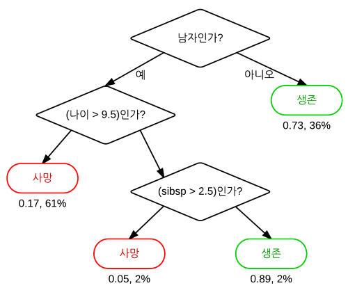

분류 규칙 이해
================
*이상민*

-----

## 분류 규칙 (classification rules)

분류 규칙은 클래스를 레이블이 없는 예시에 할당하는 논리적인 if-else문 형태로 지식을 표현한다. 분류 규칙은 조건부와
결론부를 명시한다. 즉, “이것이 발생한다면 저것이 발생한다.”라는 가설을 구성한다. 조건부는 특정 특징 값들의
조합으로 이루어지지만, 결론부는 규칙의 조건을 만족할 때 배정할 클래스 값을 지정한다. 의사 결정 트리처럼 미래의 행동을
위한 지식을 만들어내는 응용헤 사용할 수 있으며, 다음과 같은 것들이 있다.

  - 기계 장비에 하드웨어 고장을 유발하는 조건의 식별
  - 고객 세분화를 위한 그룹의 주요 특징 기술
  - 주식 시장에서 큰 폭의 주가 하락이나 증가 상승에 선행하는 조건을 찾는 일

규칙 학습자는 일반적으로 특징이 주로 또는 전체적으로 명목형인 문제에 적용된다. 또한 의사 결정 트리보다 조금 더 단순하고
직접적이고 이해하기가 쉽다.

-----

### 분리 정복

분류 규칙 학습자는 분리 정복으로 알려진 휴리스틱을 활용한다. 이 과정에서는 훈련 데이터에서 예시의 부분집합을 커버하는 규칙을
식별하고 이 부분집합을 나머지 데이터와 분리한다. 규칙이 추가되면서 데이터의 부분집합도 추가적으로 분리되고, 전체
데이터셋이 모두 커버되어 더 이상의 예시가 남아있지 않을 때까지 진행된다.  
규칙이 데이터의 부분을 커버하는 것처럼 보이기 때문에 분리 정복 알고리즘은 커버링 알고리즘이라고도 한다.

-----

### 1R 알고리즘

1R 알고리즘(One Rule)은 하나의 규칙을 선택하는 방식으로 ZeroR을 개선했다. (ZeroR은 글자 그대로 어떠한 특징도
고려하지 않으며 아무 규칙도 학습하지 않는 규칙 학습자). 1R 알고리즘의 장단점은 다음 표와 같다.

| 장점                                | 단점          |
| --------------------------------- | ----------- |
| 이해하기 쉽고 사람이 읽을 수 있는 하나의 경험적 규칙 생성 | 하나의 특징만을 사용 |
| 복잡한 알고리즘의 기준점으로 제공될 수 있음          | 너무 단순할 수 있음 |

1R은 각 특징에 대해 유사한 값을 기준으로 데이터를 그룹으로 분리한다. 그런 다음 알고리즘은 각 세그먼트에 대해 대다수 클래스를
예측한다. 각 특징에 기반을 두는 규칙의 오류율을 계산하고 최소 오류를 갖는 규칙을 단일 규칙으로 선정한다.

-----

### 리퍼 알고리즘

리퍼는 IREP를 개선한 것으로, 의사 결정 트리의 성능에 필적하거나 능가하는 규칙을 생성한다.

| 장점                        | 단점                                    |
| ------------------------- | ------------------------------------- |
| 이해하기 쉽고 사람이 읽을 수 있는 규칙 생성 | 상식이나 전문가 지식에 위배되는 것처럼 보이는 규칙이 생길 수 있음 |
| 크고 노이즈가 있는 데이터셋에 효율적      | 수치 데이터 작업에 적합하지 않음                    |

리퍼 알고리즘은 규칙 학습용 효율적인 휴리스틱들을 여러 부분으로 연결했다. 일반적으로 다음과 같은 3단계의 과정으로 이해할 수
있다.

1.  기르기
2.  가지치기
3.  최적화하기

리퍼 알고리즘은 하나 이상의 특징을 고려할 수 있기 때문에 1R 알고리즘보다 조금 더 복잡한 규칙을 생성할 수 있다. 이것이
의미하는 것은 복수의 조건부를 갖는 규칙을 생성할 수 있다는 점이다. 따라서 복잡한 데이터를 모델링하는 알고리즘 능력은
향상되지만, 의사 결정 트리처럼 금방 규칙을 파악하기가 어려워질 수 있다.

-----

### 의사 결정 트리에서 규칙 구성

의사 결정 트리에서 분류 규칙을 직접 얻을 수 있다. 리프 노드에서 시작해서 분기를 따라 루트로 되돌아가면서 일련의 결정을 얻을
수 있고, 이 결정들을 하나의 규칙으로 결합할 수 있다.

루트 노드에서 리프 노드까지 경로를 따라 규칙은 다음과 같을 것이다.

1.  남자이지 않다면 생존할 것이다.
2.  남자이고 나이가 10세 이상이면 사망할 것이다.
3.  남자이고 나이가 9세 이하이고 형제가 셋 이상이면 사망할 것이다.
4.  남자이고 나이가 9세 이하이고 형제가 둘 이하면 생존할 것이다.

규칙을 생성하고자 의사 결정 트리를 사용하는 방식의 주요 단점은 생성된 규칙이 규칙 학습 알고리즘으로 학습된 규칙보다 더
복잡하다는 것이다.

-----

### 무엇이 트리와 규칙을 탐욕스럽게 만드는가?

의사 결정 트리와 규칙 학습자는 탐욕 학습자(greedy learners)로 알려져 있는데, 이 방법은 선입 선처리(FCFS,
First-Come First-Served) 기반으로 데이터를 사용하기 때문이다.  
탐욕 방식의 단점은 특정 데이터셋에 최적이고, 가장 정확하고, 최소 개수로 된 규칙을 생성하는 것을 탐욕 알고리즘이 보장하지
못한다는 점이다. 가장 쉽게 달성할 수 있는 목표를 빨리 이룸으로써 탐욕 학습자는 데이터의 한 부분집합에 대해 정확한
한 개의 규칙을 빠르게 발견할 수 있다. 하지만 학습자는 전체 데이터셋에 대해 더 나은 정확도를 갖는 조금 더 섬세한 규칙을
개발할 기회를 잃게 된다.

