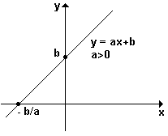
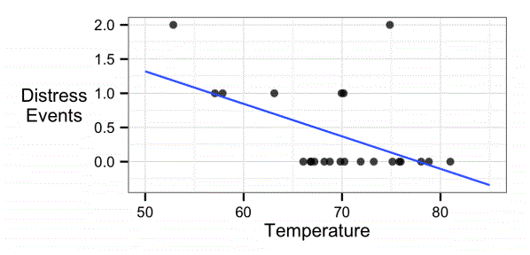
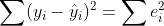

회귀 방법
================
*이상민*

-----

  - 수치 관계의 크기와 강도를 모델링하는 기법인 회귀에 사용되는 기본 통계 원칙
  - 회귀 분석용 데이터 준비와 회귀 모델을 추정하고 해석하는 방법
  - 수치 예측 작업에 의사 결정 트리 분류기를 적용하는 회귀 트리와 모델 트리라는 한 쌍의 하이브리드 기법

## 회귀의 이해

회귀에는 한 개의 수치 **종속 변수**(예측값)와 한 개 이상의 수치 **독립 변수**(예측 변수) 사이의 관계를 명시하는 것과
관련된다. 종속 변수는 독립 변수의 값에 따라 달라진다. 가장 단순한 회귀 형태는 독립 변수와 종속 변수가 직선 관계라고
가정한다.  
직선은 y = a + bx 같은 기울기 절편 형식으로 정의된다. 문자 y는 종속 변수, x는 독립 변수를 가리킨다. 기울기 항
b는 x가 증가할 때마다 직선이 얼마나 올라가는지를 명시한다. a는 절편이라고 하는데, 직선이 세로 y축과 교차하는 지점을
명시한다.

<div style="text-align: center">



</div>

기계가 해야 할 일은 명시된 선이 제공된 x 값과 y 값의 관계를 가장 잘 나타내도록 a와 b의 값을 찾아내는 것이다.  
회귀는 과거를 설명하는 데 사용할 수 있으며, 동시에 미래의 값을 외삽하는 등 거의 모든 작업에 응용할 수 있다. 구체적인 사례는
다음과 같다.

  - 다양한 분야의 과학 연구에 사용하고자 측정된 특성에 따라 인구와 개인이 어떻게 변화하는지 검토
  - 사건과 반응 간의 인과 관계의 정량화 (마케팅 조사 등)
  - 보험금 청구, 범죄율 예측과 같이 알려진 기준이 있을 때 미래의 행위를 예측하는 데 사용되는 패턴 식별

-----

### 단순 선형 회귀

1986년 1월 29일, 미국 우주 왕복선 챌린저가 로켓 부스터 고장으로 끔찍하게 분해되면서 일곱 명의 승무원이 사망했다. 로켓
연결 부분의 밀봉을 담당하는 패킹용 고무 오링(O-ring)이 40℉ 미만에서는 테스트되지 않았었고, 발사 당일의 날씨가
평소와 달리 매우 춥고 영하인 상태였다. 다음 산포도는 발사할 때 온도와 비교해 과거 23회의 발사에서 탐지된 주요
오링의 손상을 도표로 보여준다.

<div style="text-align: center">


</div>

도포를 관찰해보면 고온에서 발사할 때 오링의 손상 이벤트가 적어지는 것을 알 수 있다. 또한 가장 낮은 온도인 53℉의 발사에서
두 번의 손상 이벤트가 있었다. 이러한 정보를 토대로 보면 20℉ 보다 더 낮은 온도에서 챌린저를 발사할 계획은 뭔가 개운치
않다.  
우주 왕복선 발사 데이터의 방정식에서 추정된 회귀 파라미터가 a = 3.70, b = -0.048이라고 가정해보자. 위에서 언급한
선형 방정식에 대입하면 y = 3.70 - 0.048x라는 식이 나온다. 산포도에 이와 같은 직선을 그리면 다음과 같다.

<div style="text-align: center">



</div>

직선에서 볼 수 있듯 60℉에서 한 개 조금 못 미치는 오링 파손이, 70℉ 에서는 약 0.3개의 파손이 예상된다. 챌린저 발사의
예상 온도인 31℉까지 모델을 외삽하면 오링 손상 이벤트는 3.70 - 0.048 \* 31 = 2.21로 예상된다. 오링이
고장날 때마다 재앙적 연료 누출의 발생 가능성이 있다고 가정하면 챌린저를 31℉에서 발사하는 것은 60℉에서 발사하는
것보다 거의 3배 정도 위험하고, 70℉에서 발사하는 것보다 8배 이상 위험하다.

-----

### 보통 최소 제곱 추정

a, b의 최적 추정치를 결정하고자 **보통 최소 제곱법(OLS, Ordinary Least Squares)** 방법을 사용했다.
OLS 회귀에서 기울기와 절편은 **오차 제곱합(SSE, Sum of the Squared Errors)**이 최소화되게
선택된다. 잔차라고도 알려진 이 오차는 y의 예측 값과 실제 값 사이의 수직 거리의 차이다.

<div style="text-align: center">


</div>

수학적 용어로 OLS 회귀의 목표는 다음 방정식을 최소화하는 작업으로 표현된다.

<div style="text-align: center">



</div>

이 방정식은 y의 실제 값과 예측 값의 차로 e(오차)를 정의한다. 오차 값은 음수를 없애고자 모두 제곱되고, 데이터의 모든 점을
합산한다.  
a의 해는 b 값에 종속된다. 이 값은 다음 식으로 얻을 수 있다. x와 y항의 위에 있는 가로 막대는 x와 y의 평균값을
가리킨다.

<div style="text-align: center">


</div>

최소 제곱 오차(minimum squared error)를 만드는 b 값은 다음 식과 같으며 이 식은 공분산 함수를 분산 함수로
나눈 것과 같다.

<div style="text-align: center">


</div>

launch라는 이름의 우주 왕복선 발사 데이터가 있고 독립 변수 x의 이름은 temperature, 종속 변수 y의 이름은
distress\_ct라고 가정하자.

``` r
b <- cov(launch$temperature, launch$distress_ct) / var(launch$temperature)
b
```

    ## [1] -0.04753968

``` r
a <- mean(launch$distress_ct) - b * mean(launch$temperature)
a
```

    ## [1] 3.698413

-----

### 상관관계

두 변수 간의 상관관계(correlation)는 변수의 관계가 직선에 가깝게 따르는 정도를 나타내는 숫자다. 다른 조건이 없다면
상관관계는 피어슨 상관 계수를 나타낸다. 상관관계는 -1에서 +1 사이의 범위에 있고 0에 가까울수록 상관관계는 선형 관계가
없음을 나타낸다.

<div style="text-align: center">


</div>

``` r
r <- cov(launch$temperature, launch$distress_ct) / 
    (sd(launch$temperature) * sd(launch$distress_ct))
r
```

    ## [1] -0.5111264

``` r
cor(launch$temperature, launch$distress_ct)
```

    ## [1] -0.5111264

음의 상관관계는 온도가 증가하면 손상된 오링의 개수가 감소하는 관계를 의미한다. 이 값은 오링 데이터를 연구하는 NASA
엔지니어에게 저온 발사가 문제가 될 수 있다는 매우 명확한 지표가 될 것이다.

| 상관계수       | 강도           |
| ---------- | ------------ |
| 0.1 \~ 0.3 | 약한(week)     |
| 0.3 \~ 0.5 | 보통(moderate) |
| 0.5 이상     | 강한(strong)   |

두 변수 간에 상관관계를 측정하면 독립 변수와 종속 변수 간의 관계를 빠르게 판단할 수 있다. 이는 예측 변수가 많은 회귀 모델을
정의할 때 더욱 중요해질 것이다.

-----

### 다중 선형 회귀

대부분의 실제 분석에서는 하나 이상의 독립 변수를 갖는다. 그러므로 대부분의 수치 예측 작업은 다중 선형 회귀를 사용할 가능성이
높다.

| 장점                             | 단점                             |
| ------------------------------ | ------------------------------ |
| 수치 데이터를 모델링하기 위한 가장 일반적인 방법    | 데이터에 대한 강한 가정                  |
| 어떤 모델링 작업에든 대부분 적용             | 누락 데이터 처리하지 않음                 |
| 특징과 결과 간의 관계에 대한 강도와 크기 추정치 제공 | 수치 특징만 처리 (범주 데이터는 추가적인 준비 필요) |

다중 회귀 모델은 일반적으로 다음 방정식 형태를 따른다. 종속 변수 y는 절편 항 α와 각 특징 i에 대해 추정된 β 값과 x
변수를 곱해 더한 값으로 명시된다. 오차 항 ε(epsilon)은 예측이 완벽하지 않다는 것을 상기시키고자 더해졌다.

<div style="text-align: center">


</div>

이것을 굵은 글꼴 행렬 표기를 이용해 나타낸다. 이제 목표는 Y의 예측 값과 실제 값 사이의 오차 제곱합을 최소화하는 회귀 계수인
벡터 β를 푸는 것이다.  

<div style="text-align: center">


</div>

따라서 벡터 β의 추정치인 β-hat을 구하면 아래와 같다.

<div style="text-align: center">


</div>

다음 코드로 파라미터 y와 x를 받아 추정된 β 계수의 벡터를 반환하는 기본 회귀 함수 reg()를 생성할 수 있다.

``` r
reg <- function(y, x) {
    x <- as.matrix(x)
    x <- cbind(Intercept = 1, x)
    # solve() : 역행렬
    # t()     : 전치행렬
    # %*%     : 두 개의 행렬 곱
    b <- solve(t(x) %*% x) %*% t(x) %*% y
    colnames(b) <- "estimate"
    print(b)
}
```

``` r
str(launch)
```

    ## 'data.frame':    23 obs. of  4 variables:
    ##  $ distress_ct         : int  0 1 0 0 0 0 0 0 1 1 ...
    ##  $ temperature         : int  66 70 69 68 67 72 73 70 57 63 ...
    ##  $ field_check_pressure: int  50 50 50 50 50 50 100 100 200 200 ...
    ##  $ flight_num          : int  1 2 3 4 5 6 7 8 9 10 ...

``` r
reg(y = launch$distress_ct, x = launch[2])
```

    ##                estimate
    ## Intercept    3.69841270
    ## temperature -0.04753968

``` r
reg(y = launch$distress_ct, x = launch[2:4])
```

    ##                          estimate
    ## Intercept             3.527093383
    ## temperature          -0.051385940
    ## field_check_pressure  0.001757009
    ## flight_num            0.014292843

모델은 오링의 손상 이벤트 횟수(distress\_ct)와 온도(temperature), 현장 검사
압력(field\_check\_pressure), 발사 ID 번호(flight\_num)을 예측한다. 두 개의 새로운 예측
변수를 포함시켰지만 이전 단순 회귀 모델의 결과와 차이가 없다.  
field\_check\_pressure는 발사 이전에 오링을 테스트하고자 가한 압력의 양을 말한다. 계수는 양수지만 작고,
적어도 이 가정을 뒷받침해 준다. flight\_num은 우주 왕복선의 나이를 설명하고자 포함된다. 각 비행에서 우주
왕복선이 오래될수록 부품들이 더 잘 부서지고 고장이 나는 경향이 있다. 비행 번호와 파손 횟수 간의 작은 연관성이 이런 사실을
반영한다.
