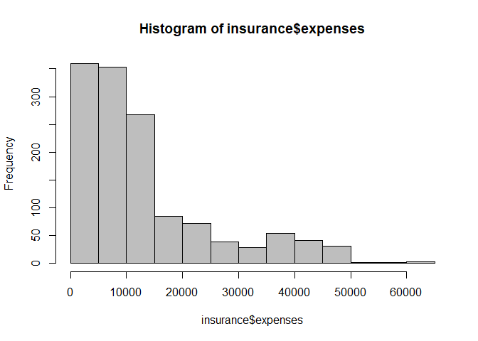
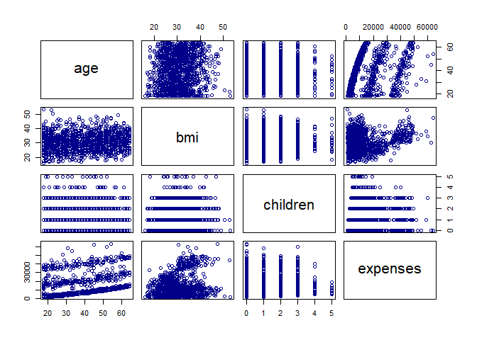
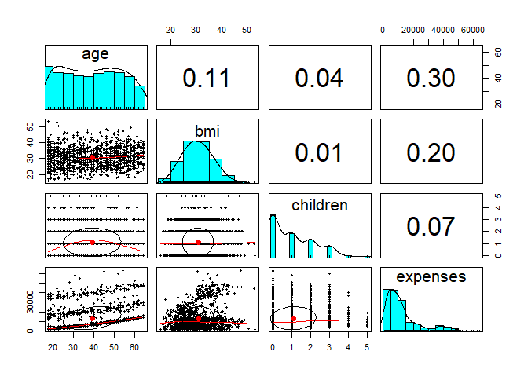
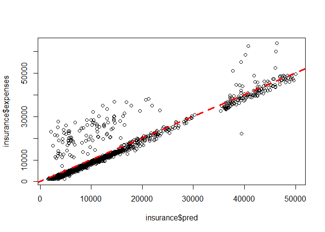

선형 회귀를 이용한 의료비 예측
================
*이상민*

## 의료비 예측

이 분석의 목적은 환자 데이터를 이용해 인구 세그먼트별로 평균 의료비를 예측하는 것이다. 이 추정은 예상 치료비에 따라 연간
보험료를 좀 더 높게 또는 더 낮게 설정하는 보험 통계표를 만들고자 사용할 수 있다.

-----

### 1단계 : 데이터 수집

미국 환자의 가상 의료비가 들어있는 모의 데이터셋을 사용한다. insurance.csv 파일에는 현재 의료보험에 등록된
1,338명의 수익자 예시가 들어 있다. 그리고 각 예시는 환자의 특성과 해당 연도에 의료보험에 청구된 전체 의료비를 나타내는
특징으로 구성돼 있다.

| 특징       | 설명                                  |
| -------- | ----------------------------------- |
| age      | 주 수익자의 연령 (정수)                      |
| sex      | 보험 계약자 성별 (여성 / 남성)                 |
| bmi      | 신체 용적 지수 (몸무게를 키의 제곱으로 나눈 값)        |
| children | 의료보험이 적용되는 자녀 수 (정수)                |
| smoker   | 피보험자의 정기적인 흡연 여부 (예 / 아니오)          |
| region   | 미국 내 수익자의 거주 지역 (북동 / 남동 / 남서 / 북서) |

-----

### 2단계 : 데이터 탐색과 준비

``` r
insurance <- read.csv("insurance.csv", stringsAsFactors = TRUE)
str(insurance)
```

    ## 'data.frame':    1338 obs. of  7 variables:
    ##  $ age     : int  19 18 28 33 32 31 46 37 37 60 ...
    ##  $ sex     : Factor w/ 2 levels "female","male": 1 2 2 2 2 1 1 1 2 1 ...
    ##  $ bmi     : num  27.9 33.8 33 22.7 28.9 25.7 33.4 27.7 29.8 25.8 ...
    ##  $ children: int  0 1 3 0 0 0 1 3 2 0 ...
    ##  $ smoker  : Factor w/ 2 levels "no","yes": 2 1 1 1 1 1 1 1 1 1 ...
    ##  $ region  : Factor w/ 4 levels "northeast","northwest",..: 4 3 3 2 2 3 3 2 1 2 ...
    ##  $ expenses: num  16885 1726 4449 21984 3867 ...

``` r
summary(insurance$expenses)
```

    ##    Min. 1st Qu.  Median    Mean 3rd Qu.    Max. 
    ##    1122    4740    9382   13270   16640   63770

평균값이 중앙값보다 크기 때문에 의료비 분포는 오른쪽으로 꼬리가 긴 분포이다. 히스토그램을 이용하여 시각적으로 확인해보면 대다수
사람들의 연간 의료비는 0에서 $15,000 사이에 있다.

``` r
hist(insurance$expenses, col="grey")
```

<!-- -->

회귀 모델은 모든 특징이 수치여야 하지만, 현재 insurance 데이터 프레임에는 세 개의 factor feature가
존재한다. <br><br>

#### 특징 간 관계 탐색 : 상관 행렬

**상관 행렬(correlation matrix)**은 독립 변수와 종속 변수가 어떻게 관계되는지에 대한 빠른 요약을 제공한다.

``` r
cor(insurance[c("age", "bmi", "children", "expenses")])
```

    ##                age        bmi   children   expenses
    ## age      1.0000000 0.10934101 0.04246900 0.29900819
    ## bmi      0.1093410 1.00000000 0.01264471 0.19857626
    ## children 0.0424690 0.01264471 1.00000000 0.06799823
    ## expenses 0.2990082 0.19857626 0.06799823 1.00000000

age와 bmi는 약한 양의 상관관계가 있어서 나이가 들수록 몸무게가 증가하는 경향이 있다. 또한 age와 expenses,
bmi와 expenses, children과 expenses가 양의 상관관계를 갖는다. 이러한 연관성은 나이, 몸무게, 자녀 수가
증가할 때 예상 보험금이 올라간다는 것을 의미한다. <br><br>

#### 특징 간 관계 시각화 : 산포도 행렬

**산포도 행렬(scatterplot matrix)**은 세 개 이상의 변수에서 패턴을 찾을 때 사용된다.

``` r
pairs(insurance[c("age", "bmi", "children", "expenses")], col="darkblue")
```

<!-- -->

산포도 행렬에서 각 행과 열의 교차점에는 행, 열 쌍이 가리키는 변수의 산포도가 있다. 대각선 위와 아래의 다이어그램은 x축과
y축을 바꾼 것이기 때문에 전치다. age와 expenses의 관계는 상대적으로 여러 직선으로 보이고, bmi와
expenses 그림은 두 개의 구분되는 점 그룹을 갖는다.

``` r
library(psych)
pairs.panels(insurance[c("age", "bmi", "children", "expenses")])
```

<!-- -->

psych 패키지의 pairs.panels() 함수는 대각선 위쪽의 산포도를 상관관계 행렬로 대체하여 보여준다. 대각선에는 각
특징별로 값의 분포를 묘사하고 있는 히스토그램이 보이고, 대각선 아래에 있는 산포도에는 추가적인 시각 정보가 표현된다.
산포도에 있는 타원 모양의 객체는 상관관계 타원형으로 타원이 늘어질수록 상관관계는 강해진다. bmi와 children처럼
거의 완벽하게 둥근 타원 모양은 아주 약한 상관관계를 나타낸다.  
산포도에 그려진 곡선을 **뢰스 곡선(loess curve)**라고 한다. 이 곡선은 x와 y축 변수 사이에 일반적인 관계를
나타낸다. age와 children의 곡선은 U를 뒤집은 모양으로 중년 무렵에 최고점이 된다. 이것은 고령과 젊은이는
중년보다 의료보험에서 보장하는 자녀 수가 적다는 것을 뜻한다.

-----

### 3단계 : 데이터로 모델 훈련

R에서 선형 회귀 모델을 데이터에 적합시키려면 stats 패키지의 lm() 함수를 사용하면 된다.

``` r
             # expenses ~ age + sex + bmi + children + smoker + region
ins_model <- lm(expenses~., data = insurance)
ins_model
```

    ## 
    ## Call:
    ## lm(formula = expenses ~ ., data = insurance)
    ## 
    ## Coefficients:
    ##     (Intercept)              age          sexmale              bmi  
    ##        -11941.6            256.8           -131.4            339.3  
    ##        children        smokeryes  regionnorthwest  regionsoutheast  
    ##           475.7          23847.5           -352.8          -1035.6  
    ## regionsouthwest  
    ##          -959.3

모델 수식에는 특징을 여섯 개만 명시했지만, 보고된 계수는 여덟 개이다. 이는 lm() 함수가 더미 코딩 기법을 모델의 팩터 타입
변수에 자동으로 적용했기 때문이다. 더미 변수는 관측이 명시된 범주에 속하면 1로, 그렇지 않으면 0으로 설정한다.  
예를 들어 sex 특징은 male, female 두 개의 범주를 갖는다. R은 이것을 sexmale과 sexfemale로 이름을
지어 sex = male인 관측은 sexmale = 1이고 sexfemale = 0이다. 반대로 sex = female인
관측은 sexmale = 0이고 sexfemale = 1이다.  
따라서 남성은 여성에 비해 매년 의료비가 $131.40 적게 들고, 흡연자는 비흡연자보다 매년 평균 $23,847.50의 비용이
더 든다. 모델에서 세 지역의 계수는 음수고, 이는 참조 그룹인 북동 지역의 평균 비용이 가장 높은 경향이 있음을 의미한다.

-----

### 4단계 : 모델 성능 평가

``` r
summary(ins_model)
```

    ## 
    ## Call:
    ## lm(formula = expenses ~ ., data = insurance)
    ## 
    ## Residuals:
    ##      Min       1Q   Median       3Q      Max 
    ## -11302.7  -2850.9   -979.6   1383.9  29981.7 
    ## 
    ## Coefficients:
    ##                 Estimate Std. Error t value Pr(>|t|)    
    ## (Intercept)     -11941.6      987.8 -12.089  < 2e-16 ***
    ## age                256.8       11.9  21.586  < 2e-16 ***
    ## sexmale           -131.3      332.9  -0.395 0.693255    
    ## bmi                339.3       28.6  11.864  < 2e-16 ***
    ## children           475.7      137.8   3.452 0.000574 ***
    ## smokeryes        23847.5      413.1  57.723  < 2e-16 ***
    ## regionnorthwest   -352.8      476.3  -0.741 0.458976    
    ## regionsoutheast  -1035.6      478.7  -2.163 0.030685 *  
    ## regionsouthwest   -959.3      477.9  -2.007 0.044921 *  
    ## ---
    ## Signif. codes:  0 '***' 0.001 '**' 0.01 '*' 0.05 '.' 0.1 ' ' 1
    ## 
    ## Residual standard error: 6062 on 1329 degrees of freedom
    ## Multiple R-squared:  0.7509, Adjusted R-squared:  0.7494 
    ## F-statistic: 500.9 on 8 and 1329 DF,  p-value: < 2.2e-16

  - Residuals(잔차) : 예측에서 오차에 대한 요약 통계를 제공하며, 그중 일부는 실제 매우 중요하다. **잔차 =
    실제 값 - 예측 값**과 같기 때문에 최대 오차 29981.7은 모델이 최소 하나의 관측에 대해 거의
    $30,000 정도 비용을 낮게 예측했다는 것을 의미한다.
  - Coefficients(계수)
      - Pr(\>|t|)로 표시된 **p-값(p-value)**은 추정된 계수가 실제 0일 확률 추정치다. p-값이 작은
        경우 실제 계수가 0이 아닐 가능성이 높다는 것을 말하며, 특징이 종속 변수와 관계가 없을 가능성이 아주 낮다는
        것을 의미한다.
      - 일부 p-값에는 별(\*)이 있는데, 추정치로 충족되는 유의 수준을 지정하는 각주에 해당한다. 유의 수준보다 낮은
        p-값은 통계적으로 유의한 것으로 간주된다.
  - Multiple R-squared(다중 R-제곱 값) : 결정 계수로 모델이 전체적으로 종속 변수 값을 얼마나 잘
    설명하는지를 측정한 값이다. 결정 계수는 1.0에 가까울수록 모델이 데이터를 완벽하게 설명할 수 있다는
    점에서 상관 계수와 비슷하다. R-squared 값이 0.7494이기 때문에 모델이 종속 변수 변화량의 약 75%를
    설명하고 있다.

-----

### 5단계 : 모델 성능 개선

회귀는 전형적으로 사용자가 특징을 선택하고 모델을 명시한다. <br><br>

#### 모델 명시 : 비선형 관계 추가

선형 회귀에서 독립 변수와 종속 변수 간의 관계는 선형인 것으로 가정되지만, 반드시 그럴 필요는 없다. 예를 들어 의료비 지출에
대한 연령의 영향은 전 연령에 걸쳐 일정하지 않을 것이다. 아마 최고령 인구의 경우 치료비가 과도하게 비싸질 것이다.  
비선형 관계를 고려하고자 높은 차수의 항을 회귀 모델에 추가해 모델을 다항식으로 취급한다.

<div style="text-align: center">


</div>

이렇게 하면 연령의 영향을 연령 제곱의 함수로 측정할 수 있다.

``` r
insurance$age2 <- insurance$age^2
```

<br>

#### 변환 : 수치 변수를 이진 지시 변수로 전환

특징의 영향이 누적되지 않고 특정한 임곗값에 도달한 후에만 영향을 갖는다고 가정해보자. 예를 들어 체중이 정상 범위인 사람에게는
BMI가 의료비에 미치는 영향이 없지만, 비만인 사람(BMI 30 이상)에게는 BMI가 높은 의료비와 강하게 연관되어 있다.  
이 관계를 BMI가 최소 30이면 1이고, 30 미만이면 0인 이진 비만 지시 변수를 생성해서 모델링할 수 있다.

``` r
insurance$bmi30 <- ifelse(insurance$bmi >= 30, 1, 0)
```

<br>

#### 모델 명시 : 상호작용 영향 추가

지금까지 각 특징이 개별적으로 결과에 기여한 것만을 고려했다. 어떤 특징이 종속 변수에 대해 결합된 영향을 미친다면 어떨까? 예를
들어 흡연과 비만은 각자 유해한 영향을 미치지만, 이들이 결합된 영향이 각각의 합보다 나쁘다고 가정하는 것은 합리적이다.  
이렇듯 두 특징이 결합된 영향을 가질 때 이것을 **상호작용(interaction)**이라고 한다. bmi30 변수와 smoker
변수를 상호작용시키려면 수식을 **expenses \~ bmi30 \* smoker** 형식으로 작성한다. <br>

#### 모두 합치기 : 개선된 회귀 모델

개선 사항을 요약하면 다음과 같다.

  - 나이에 대한 비선형 항목 추가
  - 비만에 대한 지시 변수 생성
  - 비만과 흡연 간의 상호작용 명시

<!-- end list -->

``` r
ins_model2 <- lm(expenses ~ age + age2 + children + bmi + sex + region + bmi30*smoker,
                 data = insurance)
summary(ins_model2)
```

    ## 
    ## Call:
    ## lm(formula = expenses ~ age + age2 + children + bmi + sex + region + 
    ##     bmi30 * smoker, data = insurance)
    ## 
    ## Residuals:
    ##      Min       1Q   Median       3Q      Max 
    ## -17297.1  -1656.0  -1262.7   -727.8  24161.6 
    ## 
    ## Coefficients:
    ##                   Estimate Std. Error t value Pr(>|t|)    
    ## (Intercept)       139.0053  1363.1359   0.102 0.918792    
    ## age               -32.6181    59.8250  -0.545 0.585690    
    ## age2                3.7307     0.7463   4.999 6.54e-07 ***
    ## children          678.6017   105.8855   6.409 2.03e-10 ***
    ## bmi               119.7715    34.2796   3.494 0.000492 ***
    ## sexmale          -496.7690   244.3713  -2.033 0.042267 *  
    ## regionnorthwest  -279.1661   349.2826  -0.799 0.424285    
    ## regionsoutheast  -828.0345   351.6484  -2.355 0.018682 *  
    ## regionsouthwest -1222.1619   350.5314  -3.487 0.000505 ***
    ## bmi30            -997.9355   422.9607  -2.359 0.018449 *  
    ## smokeryes       13404.5952   439.9591  30.468  < 2e-16 ***
    ## bmi30:smokeryes 19810.1534   604.6769  32.762  < 2e-16 ***
    ## ---
    ## Signif. codes:  0 '***' 0.001 '**' 0.01 '*' 0.05 '.' 0.1 ' ' 1
    ## 
    ## Residual standard error: 4445 on 1326 degrees of freedom
    ## Multiple R-squared:  0.8664, Adjusted R-squared:  0.8653 
    ## F-statistic: 781.7 on 11 and 1326 DF,  p-value: < 2.2e-16

  - R-squared : 0.7509 -\> 0.8664
  - Adjusted R-squared : 0.7494 -\> 0.8653
  - age2, bmi30 : statistically significant

<br>

#### 회귀 모델로 예측

``` r
insurance$pred <- predict(ins_model2, insurance)

cor(insurance$pred, insurance$expenses)
```

    ## [1] 0.9307999

상관계수 값이 0.93이므로 예측과 실제 값 사이에 매우 강한 선형 관계가 있음을 알 수 있다.

``` r
plot(insurance$pred, insurance$expenses)
abline(a = 0, b = 1, col = "red", lwd = 3, lty = 2)
```

<!-- --> 직선
위쪽의 대각선에서 떨어져 있는 점들은 실제 비용이 개닷값보다 큰 경우, 직선 아래는 예상 의료비보다 실제 값이 더 작은 경우이다.

이제 잠재적으로 의료 보험에 새로 등록할 사람의 비용을 예상해야한다. 예를 들어 northeast에 사는 두 자녀를 둔 30세의
과체중인 비흡연 남자의 보험 비용을 추정하려면 다음과 같이 입력한다.

``` r
predict(ins_model2,
        data.frame(age = 30, age2 = 30^2, children = 2,
                   bmi = 30, sex = "male", bmi30 = 1,
                   smoker = "no", region = "northeast"))
```

    ##        1 
    ## 5973.774

동일한 조건의 여성인 경우는 아래와 같다.

``` r
predict(ins_model2,
        data.frame(age = 30, age2 = 30^2, children = 2,
                   bmi = 30, sex = "female", bmi30 = 1,
                   smoker = "no", region = "northeast"))
```

    ##        1 
    ## 6470.543

두 값의 차이 5,973.774 - 6,470.543 = -496.769는 sexmale의 회귀 모델 계수와 동일하다. 앞에서
설명한 대로 다른 모든 조건이 동일하다면 평균적으로 남자는 여성보다 연간 $496를 덜 소비한다.
