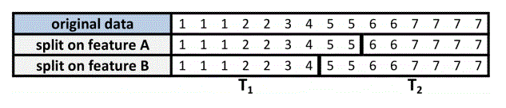

회귀 트리와 모델 트리
================
*이상민*

## 회귀 트리와 모델 트리의 이해

  - 수치 예측용 트리
      - 회귀 트리(regression trees)
      - 분류와 회귀 트리(CART, Classification and Regression Tree)

분류와 회귀 트리를 모델 트리라고 한다. 모델 트리는 회귀 트리와 거의 같은 방식으로 성장하지만, 리프 노드에서 노드에 도달한
예시로 다중 회귀 모델을 구축한다. 리프 노드의 개수에 따라 모델 트리는 다중 회귀 모델을 몇 십 개 또는 몇 백 개
구축한다.

-----

### 트리에 회귀 추가

모델 트리의 장단점은 아래의 표와 같다.

| 장점                               | 단점                                 |
| -------------------------------- | ---------------------------------- |
| 의사 결정 트리의 장점 + 수치 데이터를 모델링 하는 능력 | 선형 회귀만큼 잘 알려져 있지 않음                |
| 사용자가 모델을 미리 명시하지 않아도 됨           | 많은 양의 훈련 데이터 필요                    |
| 선형 회귀보다 일부 데이터 타입에 아주 잘 맞음       | 결과에 대한 개별 특징의 전체적인 순영향을 알아내기 쉽지 않음 |
| 모델을 해석하는 데 통계 지식은 필요 없음          | 큰 트리는 회귀 모델보다 해석하기 어려움             |

수치 예측용 트리는 분류용 트리와 거의 같은 방식으로 구축된다. 루트 노드에서 시작해서 분할 정복 전략으로 데이터를 분할하며,
이때 분할 후 결과의 동질성을 가장 크게 증가시키는 특징을 분할 조건으로 한다. 하지만 수치 데이터에는 엔트로피가 정의되지
않으므로 수치 의사 결정 트리는 분산, 표준 편차, 평균과의 절대 편차 같은 통계량으로 동질성을 측정한다.

가장 일반적인 분할 기준은 **표준 편차 축소(SDR, Standard Deviation Reduction)**다.

<div style="text-align: center">


</div>

이 식은 분할 이전의 표준 편차와 분할 이후의 가중 표준 편차를 비교해 표준 편차의 축소를 측정한다. sd(T) 함수는 집합 T의
표준 편차이며, T1, T2, …, Tn은 특징에 대해 분할된 집합들이다. |T| 항은 집합 T의 관측 개수를 나타낸다.

예를 들어 트리가 이진 특징 A나 이진 특징 B에 대해 분할을 수행할지 여부를 결정하는 다음 경우를 고려해보자.

<div style="text-align: center">



</div>

``` r
tee <- c(1, 1, 1, 2, 2, 3, 4, 5, 5, 6, 6, 7, 7, 7, 7)
at1 <- c(1, 1, 1, 2, 2, 3, 4, 5, 5)
at2 <- c(6, 6, 7, 7, 7, 7)
bt1 <- c(1, 1, 1, 2, 2, 3, 4)
bt2 <- c(5, 5, 6, 6, 7, 7, 7, 7)

sdr_a <- sd(tee) - (length(at1) / length(tee) * sd(at1) +
                        length(at2) / length(tee) * sd(at2))
sdr_b <- sd(tee) - (length(bt1) / length(tee) * sd(bt1) +
                        length(bt2) / length(tee) * sd(bt2))

sdr_a
```

    ## [1] 1.202815

``` r
sdr_b
```

    ## [1] 1.392751

특징 B로 분할한 경우 SDR은 1.4 정도로 조금 더 감소돼었다. 이 경우 A로 분할할 때보다 약간 더 동질적인 집합을 만는다.
