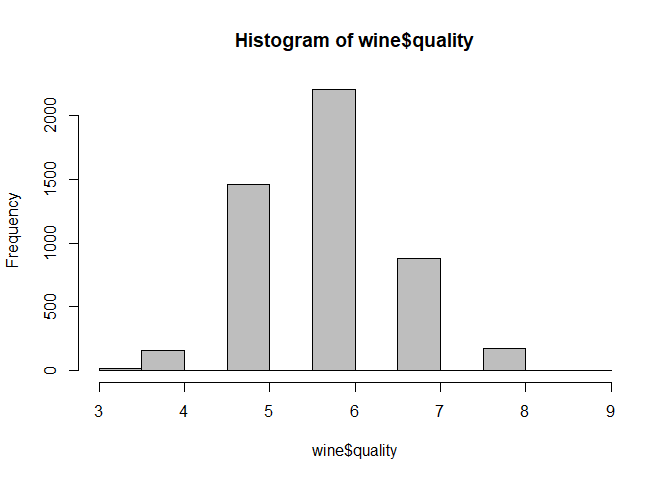
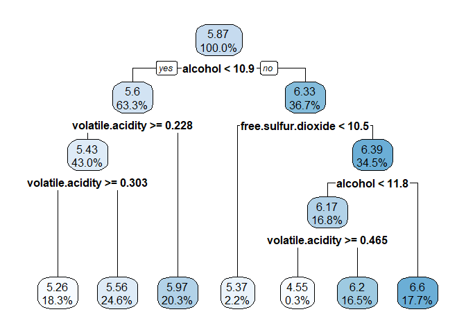
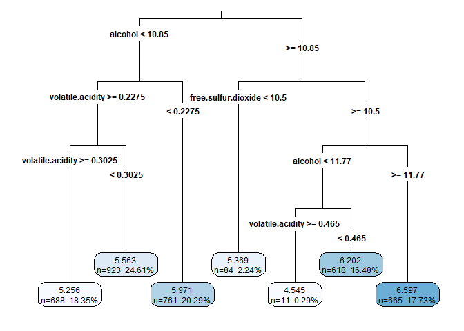
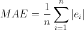

와인 품질 평가
================
*이상민*

## 회귀 트리와 모델 트리로 와인 품질 평가

와인 양조는 큰 이익을 낼 수 있는 잠재력이 있기 때문에 도전적이고 경쟁력이 있는 사업이다. 그렇지만 와인 양조장의 수익성에
기여하는 요소는 다양하다.  
그 결과 와인 양조 산업에서는 와인 양조의 의사 결정 과학을 도와주는 데이터 수집과 머신러닝 방법에 막대한 투자를 해왔다. 예를
들어 여러 지역의 와인에서 화학 성분의 주요 차이를 발견하거나 와인이 더 달콤한 맛이 나게 하는 화학 요소를 찾고자 머신러닝이
사용돼 왔다.

-----

### 1단계 : 데이터 수집

와인 평가 모델을 개발하고자 [UCI 머신러닝 데이터 저장소](http://archive.ics.uci.edu/ml)에 있는
데이터를 사용했다. 레드 와인과 화이트 와인의 종류에 따라 와인이 높이 평가되는 데 기여한 요인이 다를 수 있으므로,
이번 분석에서는 조금 더 대중적인 화이트 와인만 검토한다.  
화이트 와인 데이터는 4,898개의 와인 샘플과 11가지 화학 속성에 대한 정보가 들어있다. 각 와인별로 실험실 분석을 통해
산도(acidity), 당 함유량(sugar content), 알코올(alcohol)과 같은 특성을 측정했다. 그런 다음
3명 이상의 심사 위원단이 블라인드 테이스팅으로 샘플을 평가했으며, 평가된 품질 척도의 범위는 0(매우 나쁨)에서 10(매우
우수)까지다. 평가에 동의하지 않은 심사 위원의 경우 중앙값이 사용됐다.

-----

### 2단계 : 데이터 탐색과 준비

``` r
wine <- read.csv("whitewines.csv")
str(wine)
```

    ## 'data.frame':    4898 obs. of  12 variables:
    ##  $ fixed.acidity       : num  6.7 5.7 5.9 5.3 6.4 7 7.9 6.6 7 6.5 ...
    ##  $ volatile.acidity    : num  0.62 0.22 0.19 0.47 0.29 0.14 0.12 0.38 0.16 0.37 ...
    ##  $ citric.acid         : num  0.24 0.2 0.26 0.1 0.21 0.41 0.49 0.28 0.3 0.33 ...
    ##  $ residual.sugar      : num  1.1 16 7.4 1.3 9.65 0.9 5.2 2.8 2.6 3.9 ...
    ##  $ chlorides           : num  0.039 0.044 0.034 0.036 0.041 0.037 0.049 0.043 0.043 0.027 ...
    ##  $ free.sulfur.dioxide : num  6 41 33 11 36 22 33 17 34 40 ...
    ##  $ total.sulfur.dioxide: num  62 113 123 74 119 95 152 67 90 130 ...
    ##  $ density             : num  0.993 0.999 0.995 0.991 0.993 ...
    ##  $ pH                  : num  3.41 3.22 3.49 3.48 2.99 3.25 3.18 3.21 2.88 3.28 ...
    ##  $ sulphates           : num  0.32 0.46 0.42 0.54 0.34 0.43 0.47 0.47 0.47 0.39 ...
    ##  $ alcohol             : num  10.4 8.9 10.1 11.2 10.9 ...
    ##  $ quality             : int  5 6 6 4 6 6 6 6 6 7 ...

다른 머신러닝 모델과 비교하면 트리의 장점 중 하나는 사전 처리 없이 많은 데이터 타입을 다룰 수 있다는 점이다. 따라서 특징에
대한 정규화나 표준화를 할 필요가 없다.

``` r
hist(wine$quality, col="grey")
```

<!-- -->

``` r
wine_train <- wine[1:3750, ]     # 75% data
wine_test <- wine[3751:4898, ]   # 25% data
```

-----

### 3단계 : 데이터로 모델 훈련

rpart(재귀적 분할, recursive partitioning) 패키지는 CART 팀에서 설명한 대로 회귀 트리의 가장 충실한
구현을 제공한다.

``` r
library(rpart)

m.rpart <- rpart(quality~., data = wine_train)
m.rpart
```

    ## n= 3750 
    ## 
    ## node), split, n, deviance, yval
    ##       * denotes terminal node
    ## 
    ##  1) root 3750 2945.53200 5.870933  
    ##    2) alcohol< 10.85 2372 1418.86100 5.604975  
    ##      4) volatile.acidity>=0.2275 1611  821.30730 5.432030  
    ##        8) volatile.acidity>=0.3025 688  278.97670 5.255814 *
    ##        9) volatile.acidity< 0.3025 923  505.04230 5.563380 *
    ##      5) volatile.acidity< 0.2275 761  447.36400 5.971091 *
    ##    3) alcohol>=10.85 1378 1070.08200 6.328737  
    ##      6) free.sulfur.dioxide< 10.5 84   95.55952 5.369048 *
    ##      7) free.sulfur.dioxide>=10.5 1294  892.13600 6.391036  
    ##       14) alcohol< 11.76667 629  430.11130 6.173291  
    ##         28) volatile.acidity>=0.465 11   10.72727 4.545455 *
    ##         29) volatile.acidity< 0.465 618  389.71680 6.202265 *
    ##       15) alcohol>=11.76667 665  403.99400 6.596992 *

  - 전체 3,750개의 예시
      - alcohol \< 10.85 : 2,372개
      - alcohol \>= 10.85 : 1,378개

alcohol이 트리에서 가장 먼저 사용됐기 때문에 와인의 품질에 가장 중요한 하나의 예측 변수이다.  
별(\*) 표시가 있는 노드는 터미널 노드나 리프 노드로, 노드에서 예측이 이뤄진다는 것을 의미한다. 예를 들어 노드 5는
예측(yval)이 5.971091이다. 따라서 트리로 예측을 할 때 alcohol \< 10.85이고
volatile.acidity \< 0.2275인 모든 와인 샘플은 quality 값이 5.97로 예측된다.

<br>

#### 의사 결정 트리 시각화

``` r
library(rpart.plot)
                    # 숫자의 자리 수 조정
rpart.plot(m.rpart, digits = 3)
```

<!-- -->

``` r
rpart.plot(m.rpart, digits = 4, 
                    fallen.leaves = TRUE,  # 리프 노드가 바닥에 오도록 
                    type = 3,         
                    extra = 101)
```

<!-- -->

-----

### 4단계 : 모델 성능 평가

``` r
p.rpart <- predict(m.rpart, wine_test)

summary(p.rpart)
```

    ##    Min. 1st Qu.  Median    Mean 3rd Qu.    Max. 
    ##   4.545   5.563   5.971   5.893   6.202   6.597

``` r
summary(wine_test$quality)
```

    ##    Min. 1st Qu.  Median    Mean 3rd Qu.    Max. 
    ##   3.000   5.000   6.000   5.901   6.000   9.000

이 결과는 모델이 극단의 경우, 특히 최고와 최악의 와인을 정확하게 식별하지 못한다는 것을 의미한다. 반면 1사분위와 3사분위
사이는 잘 식별하고 있는 중이다.  
예측 값이 실제 값과 잘 일치하는지 비교하기 위해 cor() 함수를 사용한다.

``` r
cor(p.rpart, wine_test$quality)
```

    ## [1] 0.5369525

<br>

#### 평균 절대 오차로 성능 측정

**평균 절대 오차(MAE, Mean Absolute Error)**는 평균적으로 예측이 실제 값에서 얼마나 멀리 있는지를
나타낸다. MAE의 식은 다음과 같으며, 여기서 n은 예측 개수를 나타내고 e는 예측 i에 대한 오차를 나타낸다.

<p align=center>



</p>

``` r
MAE <- function(actual, predicted) {
    mean(abs(actual - predicted))
}

MAE(p.rpart, wine_test$quality)
```

    ## [1] 0.5872652

이는 평균적으로 모델의 예측과 실제 품질 점수 간의 차가 약 0.59라는 것을 의미한다. 0에서 10까지 품질 범위에서 모델이
매우 잘 작동한다는 것을 알려준다.  
위의 히스토그램에서 보았듯이 대표적인 품질 점수는 5에서 6 정도다. 따라서 단지 평균값만 예측했던 분류기는 이 측정 항목에 따라
여전히 잘 수행된다.

``` r
mean(wine_train$quality)
```

    ## [1] 5.870933

``` r
MAE(5.87, wine_test$quality)
```

    ## [1] 0.6722474

모든 와인 예시의 평균을 5.87로 예측했다면 약 0.67의 평균 절대 오차를 갖는다.

-----

### 5단계 : 모델 성능 개선

현재 모델 트리의 최신 기술은 Cubist 알고리즘으로, M5 트리 알고리즘이 강화된 것이다. Cubist 알고리즘은 결정 트리를
구축하고 트리의 가지에 기반을 두고 결정 규칙을 생성하며, 각 리프 노드에서 회귀 모델을 구축한다.

``` r
library(Cubist)
```

    ## Loading required package: lattice

``` r
m.cubist <- cubist(x = wine_train[-12], y = wine_train$quality)
m.cubist
```

    ## 
    ## Call:
    ## cubist.default(x = wine_train[-12], y = wine_train$quality)
    ## 
    ## Number of samples: 3750 
    ## Number of predictors: 11 
    ## 
    ## Number of committees: 1 
    ## Number of rules: 25

이 출력에서 알고리즘은 와인 품질을 모델링하고자 25개의 규칙을 생성했다.

``` r
p.cubist <- predict(m.cubist, wine_test)
summary(p.cubist)
```

    ##    Min. 1st Qu.  Median    Mean 3rd Qu.    Max. 
    ##   3.677   5.416   5.906   5.848   6.238   7.393

``` r
cor(p.cubist, wine_test$quality)
```

    ## [1] 0.6201015

``` r
MAE(wine_test$quality, p.cubist)
```

    ## [1] 0.5339725

상관관계 역시 크고 평균 절대 오차 또한 조금 축소됐다.
