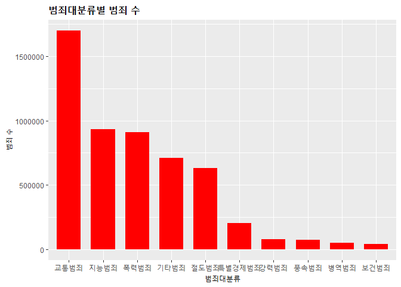
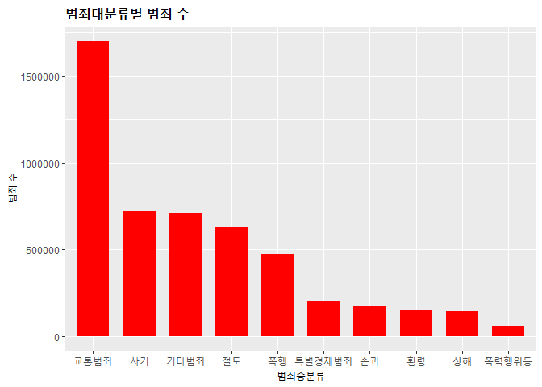
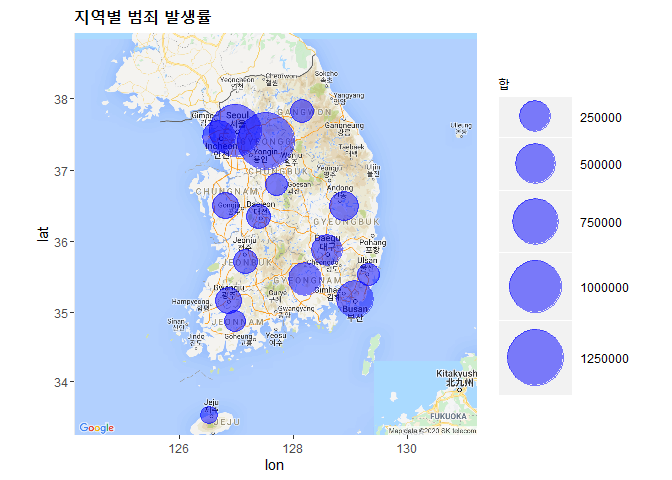

범죄 발생률 데이터 분석
================
이상민
*April 2, 2020*

## 데이터셋

출처 : <https://www.data.go.kr/dataset/3074462/fileData.do>

-----

## 범죄대분류별 범죄 수 (top 10)

    ##      범죄대분류    합계
    ## 2      교통범죄 1698226
    ## 11     지능범죄  931110
    ## 13     폭력범죄  908424
    ## 3      기타범죄  711595
    ## 10     절도범죄  632645
    ## 12 특별경제범죄  204700
    ## 1      강력범죄   78372
    ## 14     풍속범죄   73157
    ## 6      병역범죄   50703
    ## 7      보건범죄   41824

<!-- -->

-----

## 범죄중분류별 범죄 수 (top 10)

    ##      범죄중분류    합계
    ## 5      교통범죄 1698226
    ## 16         사기  720344
    ## 7      기타범죄  711595
    ## 27         절도  632645
    ## 35         폭행  474722
    ## 33 특별경제범죄  204700
    ## 22         손괴  174387
    ## 38         횡령  147283
    ## 19         상해  142643
    ## 34   폭력행위등   60242

<!-- -->

-----

## 지역별 범죄 수

    ##           합      lon      lat
    ## 경기 1296288 127.5183 37.41380
    ## 서울 1016312 126.9780 37.56654
    ## 부산  396533 129.0756 35.17955
    ## 경남  302690 128.2132 35.46060
    ## 인천  300634 126.7052 37.45626
    ## 대구  259876 128.6014 35.87144
    ## 경북  217875 128.8889 36.49190
    ## 충남  169008 126.8000 36.51840
    ## 광주  164189 126.8526 35.15955
    ## 대전  145514 127.3845 36.35041
    ## 전북  140359 127.1530 35.71750
    ## 강원  132580 128.1555 37.82280
    ## 울산  122002 129.3114 35.53838
    ## 충북  121433 127.7000 36.80000
    ## 전남  120264 126.9910 34.86790
    ## 제주  105761 126.5312 33.49962

<!-- -->
