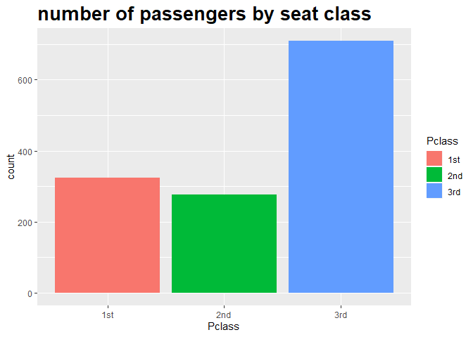
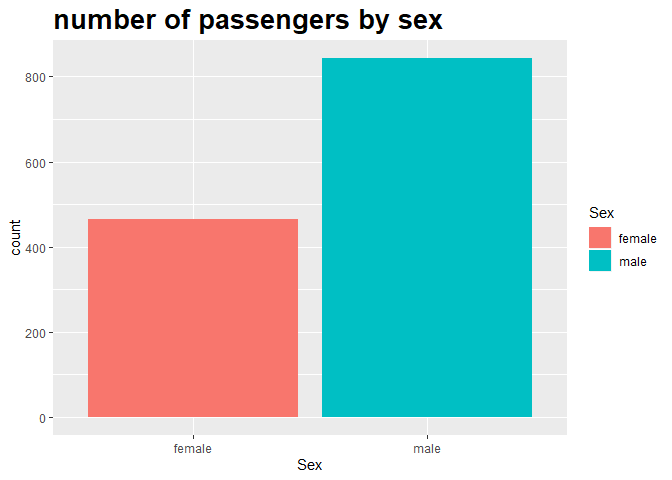

타이타닉 생존자 예측 탐색적 분석
================
*이상민*

## 데이터 설명

| Variable    | Definition            | Key                                            |
| ----------- | --------------------- | ---------------------------------------------- |
| PassengerId | 탑승객 ID                |                                                |
| Survived    | 생존여부                  | 0 = No, 1 = Yes                                |
| Pclass      | 좌석 등급                 | 1 = 1st, 2 = 2nd, 3 = 3rd                      |
| Name        | 이름                    |                                                |
| Sex         | 성별                    |                                                |
| Age         | 나이                    |                                                |
| SibSp       | 함께 탑승한 형제 자매 또는 배우자 수 |                                                |
| Parch       | 함께 탑승한 부모, 아이의 수      |                                                |
| Ticket      | 티켓 번호                 |                                                |
| Fare        | 요금                    |                                                |
| Cabin       | 객실 번호                 |                                                |
| Embarked    | 탑승 항구                 | C = Cherbourg, Q = Queenstown, S = Southampton |

-----

## 데이터 준비

``` r
library(ggplot2)
library(dplyr)
library(gridExtra)
library(DMwR)

setwd("C:/Users/sangmin/Desktop/github/kaggle/titanic")
train <- read.csv("train.csv")
test <- read.csv("test.csv")

str(train)
```

    ## 'data.frame':    891 obs. of  12 variables:
    ##  $ PassengerId: int  1 2 3 4 5 6 7 8 9 10 ...
    ##  $ Survived   : int  0 1 1 1 0 0 0 0 1 1 ...
    ##  $ Pclass     : int  3 1 3 1 3 3 1 3 3 2 ...
    ##  $ Name       : Factor w/ 891 levels "Abbing, Mr. Anthony",..: 109 191 358 277 16 559 520 629 417 581 ...
    ##  $ Sex        : Factor w/ 2 levels "female","male": 2 1 1 1 2 2 2 2 1 1 ...
    ##  $ Age        : num  22 38 26 35 35 NA 54 2 27 14 ...
    ##  $ SibSp      : int  1 1 0 1 0 0 0 3 0 1 ...
    ##  $ Parch      : int  0 0 0 0 0 0 0 1 2 0 ...
    ##  $ Ticket     : Factor w/ 681 levels "110152","110413",..: 524 597 670 50 473 276 86 396 345 133 ...
    ##  $ Fare       : num  7.25 71.28 7.92 53.1 8.05 ...
    ##  $ Cabin      : Factor w/ 148 levels "","A10","A14",..: 1 83 1 57 1 1 131 1 1 1 ...
    ##  $ Embarked   : Factor w/ 4 levels "","C","Q","S": 4 2 4 4 4 3 4 4 4 2 ...

``` r
str(test)
```

    ## 'data.frame':    418 obs. of  11 variables:
    ##  $ PassengerId: int  892 893 894 895 896 897 898 899 900 901 ...
    ##  $ Pclass     : int  3 3 2 3 3 3 3 2 3 3 ...
    ##  $ Name       : Factor w/ 418 levels "Abbott, Master. Eugene Joseph",..: 210 409 273 414 182 370 85 58 5 104 ...
    ##  $ Sex        : Factor w/ 2 levels "female","male": 2 1 2 2 1 2 1 2 1 2 ...
    ##  $ Age        : num  34.5 47 62 27 22 14 30 26 18 21 ...
    ##  $ SibSp      : int  0 1 0 0 1 0 0 1 0 2 ...
    ##  $ Parch      : int  0 0 0 0 1 0 0 1 0 0 ...
    ##  $ Ticket     : Factor w/ 363 levels "110469","110489",..: 153 222 74 148 139 262 159 85 101 270 ...
    ##  $ Fare       : num  7.83 7 9.69 8.66 12.29 ...
    ##  $ Cabin      : Factor w/ 77 levels "","A11","A18",..: 1 1 1 1 1 1 1 1 1 1 ...
    ##  $ Embarked   : Factor w/ 3 levels "C","Q","S": 2 3 2 3 3 3 2 3 1 3 ...

데이터를 통합하기 위해 test 데이터셋에도 Survived 열을 만든 후 NA값을 넣어준다.

``` r
test$Survived <- NA
train$Survived <- factor(train$Survived, levels=c(0, 1),
                         labels=c("No", "Yes"))

total <- rbind(train, test)
str(total)
```

    ## 'data.frame':    1309 obs. of  12 variables:
    ##  $ PassengerId: int  1 2 3 4 5 6 7 8 9 10 ...
    ##  $ Survived   : Factor w/ 2 levels "No","Yes": 1 2 2 2 1 1 1 1 2 2 ...
    ##  $ Pclass     : int  3 1 3 1 3 3 1 3 3 2 ...
    ##  $ Name       : Factor w/ 1307 levels "Abbing, Mr. Anthony",..: 109 191 358 277 16 559 520 629 417 581 ...
    ##  $ Sex        : Factor w/ 2 levels "female","male": 2 1 1 1 2 2 2 2 1 1 ...
    ##  $ Age        : num  22 38 26 35 35 NA 54 2 27 14 ...
    ##  $ SibSp      : int  1 1 0 1 0 0 0 3 0 1 ...
    ##  $ Parch      : int  0 0 0 0 0 0 0 1 2 0 ...
    ##  $ Ticket     : Factor w/ 929 levels "110152","110413",..: 524 597 670 50 473 276 86 396 345 133 ...
    ##  $ Fare       : num  7.25 71.28 7.92 53.1 8.05 ...
    ##  $ Cabin      : Factor w/ 187 levels "","A10","A14",..: 1 83 1 57 1 1 131 1 1 1 ...
    ##  $ Embarked   : Factor w/ 4 levels "","C","Q","S": 4 2 4 4 4 3 4 4 4 2 ...

-----

## 데이터 탐색

### NA값 처리

데이터에 존재하는 NA값과 해당 비율을 확인한다.

``` r
NA_num <- t(colSums(is.na(total)))
NA_prob <- t(colSums(is.na(total))) / nrow(total)
rbind(NA_num, NA_prob)
```

    ##      PassengerId    Survived Pclass Name Sex         Age SibSp Parch Ticket
    ## [1,]           0 418.0000000      0    0   0 263.0000000     0     0      0
    ## [2,]           0   0.3193277      0    0   0   0.2009167     0     0      0
    ##              Fare Cabin Embarked
    ## [1,] 1.0000000000     0        0
    ## [2,] 0.0007639419     0        0

Survived 열에서 나오는 NA값은 모두 test 데이터셋에 해당하므로 그 외 Age와 Fare 열의 NA값을 각각 평균값으로
대치한다.

``` r
age_sum <- total[complete.cases(total$Age), "Age"]
age_mean <- sum(age_sum) / length(age_sum)
fare_sum <- total[complete.cases(total$Fare), "Fare"]
fare_mean <- sum(fare_sum) / length(fare_sum)

for(i in 1:nrow(total)) {
    if (is.na(total$Age[i]) == TRUE) {
        total$Age[i] <- age_mean
    } else if (is.na(total$Fare[i]) == TRUE) {
        total$Fare[i] <- fare_mean
    }
}

colSums(is.na(total))
```

    ## PassengerId    Survived      Pclass        Name         Sex         Age 
    ##           0         418           0           0           0           0 
    ##       SibSp       Parch      Ticket        Fare       Cabin    Embarked 
    ##           0           0           0           0           0           0

### PassengerId 변수

탑승객 ID는 단순히 겹치는 것이 없는지만 확인한다.

``` r
length(unique(total$PassengerId)) == length(total$PassengerId)
```

    ## [1] TRUE

### Survived 변수

Survived 변수는 예측해야 하는 종속 변수이다. train 데이터셋에만 값이 들어있기 때문에 그 값을 토대로 탑승객의 생존
여부를 시각화한다. 그래프를 보면 생존하지 못한 사람이 약 1.5배 더 많다.

``` r
table(total$Survived)
```

    ## 
    ##  No Yes 
    ## 549 342

``` r
ggplot(train) +
    geom_bar(aes(x=Survived, fill=Survived)) +
    ggtitle("number of passengers survived") +
    theme(plot.title=element_text(size=20, face="bold"))
```

<!-- -->

### Pclass 변수

좌석 등급별 탑승객 수를 시각화한다. 3rd 좌석에 탑승한 승객이 가장 많다는 것을 알 수 있다.

``` r
str(total$Pclass)
```

    ##  int [1:1309] 3 1 3 1 3 3 1 3 3 2 ...

``` r
total$Pclass <- factor(total$Pclass, levels=c(1, 2, 3),
                       labels=c("1st", "2nd", "3rd"))

ggplot(total) +
    geom_bar(aes(x=Pclass, fill=Pclass)) +
    ggtitle("number of passengers by seat class") +
    theme(plot.title=element_text(size=20, face="bold"))
```

<!-- -->

종속 변수인 Survived와의 관계를 보면 p-value 값이 굉장히 작아 두 변수는 독립이 아님을 확인할 수 있다.

``` r
with(train, table(Survived, Pclass))
```

    ##         Pclass
    ## Survived   1   2   3
    ##      No   80  97 372
    ##      Yes 136  87 119

``` r
with(train, chisq.test(Survived, Pclass))
```

    ## 
    ##  Pearson's Chi-squared test
    ## 
    ## data:  Survived and Pclass
    ## X-squared = 102.89, df = 2, p-value < 2.2e-16

### Sex 변수

성별 탑승객 수를 시각화한다. 남성 탑승객이 여성 탑승객의 약 2배 가량 많다.

``` r
table(total$Sex)
```

    ## 
    ## female   male 
    ##    466    843

``` r
ggplot(total) +
    geom_bar(aes(x=Sex, fill=Sex)) +
    ggtitle("number of passengers by sex") +
    theme(plot.title=element_text(size=20, face="bold"))
```

<!-- -->

똑같이 Survived 변수와의 관계를 보면 두 변수 또한 독립이 아님을 알 수 있다.

``` r
with(train, table(Survived, Sex))
```

    ##         Sex
    ## Survived female male
    ##      No      81  468
    ##      Yes    233  109

``` r
with(train, chisq.test(Survived, Pclass))
```

    ## 
    ##  Pearson's Chi-squared test
    ## 
    ## data:  Survived and Pclass
    ## X-squared = 102.89, df = 2, p-value < 2.2e-16

### Age 변수

binwidth 값을 달리해 나이별 탑승객 수를 시각화한다. 그래프에서 보면 알 수 있듯이 특정 나이 구간에 탑승객이 몰려있는데,
이는 결측값 처리를 Age 변수의 평균값으로 했기 때문이다.

``` r
mean(total$Age)
```

    ## [1] 29.88114

``` r
age_10 <- ggplot(total) +
    geom_histogram(aes(x=Age), binwidth=10) +
    ggtitle("bin = 10")
age_1 <- ggplot(total) + 
    geom_histogram(aes(x=Age), binwidth=1) +
    ggtitle("bin = 1")

grid.arrange(age_10, age_1, ncol=2)
```

<!-- -->

따라서 knnImputation() 함수를 사용해 결측값 처리를 다시 해준다. knn 알고리즘은 다음 두 가지 조건을 만족해야
한다.

  - 연속형 변수에 사용
  - 독립 변수만 가능 (종속 변수를 예측해서 채워넣으면 안됨)

Age 변수는 연속형 변수이고, 종속 변수가 아니기 때문에 두 가지 조건을 모두 만족한다. 대체한 결측값으로 그래프를 다시 그리면
아래와 같다.

``` r
total[which(total$Age == mean(total$Age)), "Age"] <- NA

knn <- knnImputation(total)
total$Age <- knn$Age

knn_age_10 <- ggplot(total) +
    geom_histogram(aes(x=Age), binwidth=10) +
    ggtitle("bin = 10")
knn_age_1 <- ggplot(total) + 
    geom_histogram(aes(x=Age), binwidth=1) +
    ggtitle("bin = 1")

grid.arrange(knn_age_10, knn_age_1, ncol=2)
```

<!-- -->

Age 변수의 가장 큰 데이터값은 80이다. 따라서 5살 단위로 나눠 age\_group을 생성하여 나이대별 생존 비율을
시각화한다.

``` r
dt <- total[1:nrow(train), ]

max(dt$Age)
```

    ## [1] 80

``` r
age_group <- cut(dt$Age, c(seq(0, 80, 5)))

surv <- as.numeric(dt$Survived) - 1
df <- data.frame(age_group, surv)

df_surv_cnt <- aggregate(df$surv, by=list(age_group), sum)
df_age_cnt <- aggregate(df$surv, by=list(age_group), length)

df <- cbind(df_surv_cnt, df_age_cnt$x)
colnames(df) <- c("range", "survived", "count")
df$ratio <- with(df, survived / count) 

ggplot(df, aes(x=range, y=ratio)) +
    geom_bar(stat="identity", width=0.7, fill="purple") +
    ggtitle("ratio of passengers by age group") +
    theme(plot.title=element_text(size=20, face="bold"))
```

<!-- -->

영유아의 생존율이 가장 높다는 것을 확인할 수 있다.

``` r
rbind(head(df, 3), tail(df, 3))
```

    ##      range survived count     ratio
    ## 1    (0,5]       31    44 0.7045455
    ## 2   (5,10]        7    20 0.3500000
    ## 3  (10,15]       12    20 0.6000000
    ## 14 (65,70]        0     3 0.0000000
    ## 15 (70,75]        0     4 0.0000000
    ## 16 (75,80]        1     1 1.0000000

### Cabin 변수

객실 번호가 공백으로 저장된 데이터가 상당히 많다. 생존자를 예측하기 위해서는 열 전체를 삭제하는 것이 바람직할 것 같다.

``` r
head(table(total$Cabin))
```

    ## 
    ##       A10  A14  A16  A19  A20 
    ## 1014    1    1    1    1    1

``` r
sum(total$Cabin == "")
```

    ## [1] 1014

### Embarked 변수

Embarked 변수에도 2개의 공백이 포함되어 있다. Southampton 항구에서의 탑승객이 가장 많기 때문에 데이터를
대체해준다.

``` r
table(total$Embarked)
```

    ## 
    ##       C   Q   S 
    ##   2 270 123 914

``` r
str(total$Embarked)
```

    ##  Factor w/ 4 levels "","C","Q","S": 4 2 4 4 4 3 4 4 4 2 ...

``` r
total[which(total$Embarked == ""), "Embarked"] <- "S"
```

팩터를 4 level에서 3 level로 변경해주고 항구별 탑승객 수를 시각화한다.

``` r
total$Embarked <- as.factor(as.character(total$Embarked))
str(total$Embarked)
```

    ##  Factor w/ 3 levels "C","Q","S": 3 1 3 3 3 2 3 3 3 1 ...

``` r
ggplot(total) +
    geom_bar(aes(x=Embarked, fill=Embarked)) +
    ggtitle("number of passengers by embarked") +
    theme(plot.title=element_text(size=20, face="bold")) 
```

<!-- -->

종속 변수와의 관계를 보면 p-value 값이 매우 작아 두 변수 역시 독립이 아님을 알 수 있다.

``` r
with(total, table(Survived, Embarked))
```

    ##         Embarked
    ## Survived   C   Q   S
    ##      No   75  47 427
    ##      Yes  93  30 219

``` r
with(total, chisq.test(Survived, Embarked))
```

    ## 
    ##  Pearson's Chi-squared test
    ## 
    ## data:  Survived and Embarked
    ## X-squared = 25.964, df = 2, p-value = 2.301e-06
