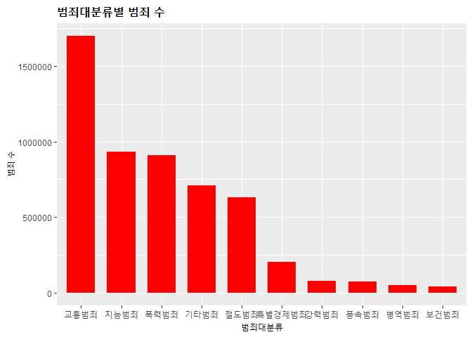
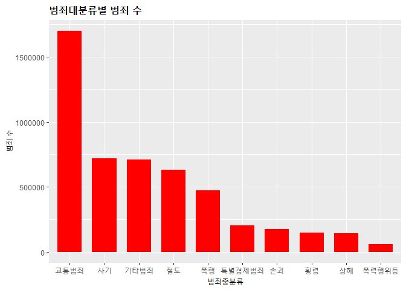
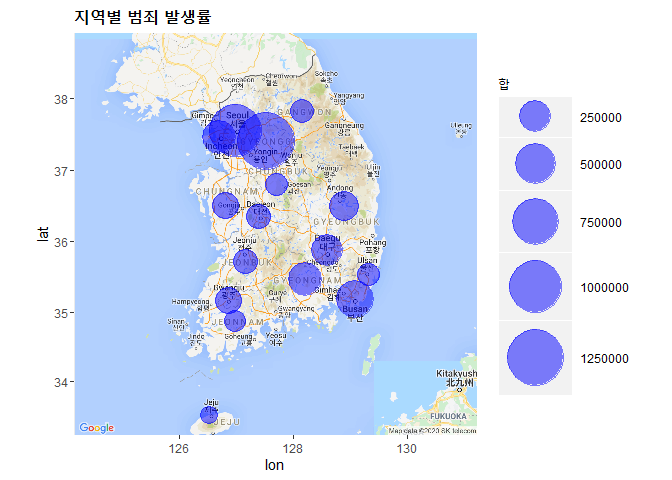

범죄 발생률 데이터 분석
================
이상민
*April 2, 2020*

## 데이터셋

출처 : <https://www.data.go.kr/dataset/3074462/fileData.do>

``` r
crime_2015 <- read.csv("2015년 범죄발생지.csv", header=T)
crime_2016 <- read.csv("2016년 범죄발생지.csv", header=T)
crime_2017 <- read.csv("2017년 범죄발생지.csv", header=T)

years <- c("2015", "2016", "2017")
crime_total <- NULL

for (i in 1:length(years)) {
    filename <- paste(years[i], "년 범죄발생지.csv", sep="")
    ds <- read.csv(filename)
    ds <- data.frame(ds)
    ds$수집년월 <- years[i]
    crime_total <- rbind(crime_total, ds)
}
```

-----

## 범죄대분류별 범죄 수 (top 10)

``` r
crime_total$합계 <- rowSums(crime_total[,-c(1,2,90)])

big_crime <- aggregate(합계~범죄대분류,
                         data=crime_total,
                         FUN=sum)

big_crime <- big_crime[order(big_crime$합계, decreasing=T), ]
big_top10 <- big_crime[1:10, ]
big_top10
```

    ##      범죄대분류    합계
    ## 2      교통범죄 1698226
    ## 11     지능범죄  931110
    ## 13     폭력범죄  908424
    ## 3      기타범죄  711595
    ## 10     절도범죄  632645
    ## 12 특별경제범죄  204700
    ## 1      강력범죄   78372
    ## 14     풍속범죄   73157
    ## 6      병역범죄   50703
    ## 7      보건범죄   41824

``` r
ggplot(big_top10, aes(x=reorder(범죄대분류, -합계), y=합계)) +
    geom_bar(stat="identity", width=0.7, fill="red") +
    ggtitle("범죄대분류별 범죄 수") +
    theme(plot.title = element_text(color="black", size=14, face="bold")) +
    labs(x="범죄대분류", y="범죄 수")
```

<!-- -->

-----

## 범죄중분류별 범죄 수 (top 10)

``` r
mid_crime <- aggregate(합계~범죄중분류,
                         data=crime_total,
                         FUN=sum)

mid_crime <- mid_crime[order(mid_crime$합계, decreasing=T), ]
mid_top10 <- mid_crime[1:10, ]
mid_top10
```

    ##      범죄중분류    합계
    ## 5      교통범죄 1698226
    ## 16         사기  720344
    ## 7      기타범죄  711595
    ## 27         절도  632645
    ## 35         폭행  474722
    ## 33 특별경제범죄  204700
    ## 22         손괴  174387
    ## 38         횡령  147283
    ## 19         상해  142643
    ## 34   폭력행위등   60242

``` r
ggplot(mid_top10, aes(x=reorder(범죄중분류, -합계), y=합계)) +
    geom_bar(stat="identity", width=0.7, fill="red") +
    ggtitle("범죄대분류별 범죄 수") +
    theme(plot.title = element_text(color="black", size=14, face="bold")) +
    labs(x="범죄중분류", y="범죄 수")
```

<!-- -->

-----

## 지역별 범죄 수

``` r
sum <- as.integer(colSums(crime_total[, -c(1,2,90)]))
sum <- c(NA, NA, sum[-88], NA, sum[88])

crime_total["합", ] <- sum
crime_tot <- crime_total["합", -c(1,2,90,91)]

crime_tot[, "경기"] <- sum(crime_tot[, c(9:36)])
crime_tot[, "강원"] <- sum(crime_tot[, c(37:43)])
crime_tot[, "충북"] <- sum(crime_tot[, c(44,45,46)])
crime_tot[, "충남"] <- sum(crime_tot[, c(47:54)])
crime_tot[, "전북"] <- sum(crime_tot[, c(55:60)])
crime_tot[, "전남"] <- sum(crime_tot[, c(61:65)])
crime_tot[, "경북"] <- sum(crime_tot[, c(66:75)])
crime_tot[, "경남"] <- sum(crime_tot[, c(76:83)])
crime_tot[, "제주"] <- sum(crime_tot[, c(84,85)])

crime_region <- crime_tot[, -c(9:85)]

crime_region <- crime_region[, order(crime_region, decreasing=T)]
crime_region <- crime_region[, -c(4, 18, 19)]
crime_region <- t(crime_region)

region <- c("경기", "서울", "부산", "경남", "인천", "대구", "경북", "충남", "광주", "대전", "전북", "강원", "울산", "충북", "전남", "제주")

gc <- geocode(enc2utf8(region))
df_region <- data.frame(crime_region, gc)
df_region
```

    ##           합      lon      lat
    ## 경기 1296288 127.5183 37.41380
    ## 서울 1016312 126.9780 37.56654
    ## 부산  396533 129.0756 35.17955
    ## 경남  302690 128.2132 35.46060
    ## 인천  300634 126.7052 37.45626
    ## 대구  259876 128.6014 35.87144
    ## 경북  217875 128.8889 36.49190
    ## 충남  169008 126.8000 36.51840
    ## 광주  164189 126.8526 35.15955
    ## 대전  145514 127.3845 36.35041
    ## 전북  140359 127.1530 35.71750
    ## 강원  132580 128.1555 37.82280
    ## 울산  122002 129.3114 35.53838
    ## 충북  121433 127.7000 36.80000
    ## 전남  120264 126.9910 34.86790
    ## 제주  105761 126.5312 33.49962

``` r
cen <- c(mean(df_region$lon), mean(df_region$lat))

map <- get_googlemap(center=cen,
                     maptype="roadmap",
                     zoom=7)
gmap <- ggmap(map)
gmap+geom_point(data=df_region,
                aes(x=lon, y=lat, size=합),
                alpha=0.5, col="blue") +
    scale_size_continuous(range=c(6, 20)) +
    ggtitle("지역별 범죄 발생률") +
    theme(plot.title = element_text(color="black", size=14, face="bold"))
```

<!-- -->
